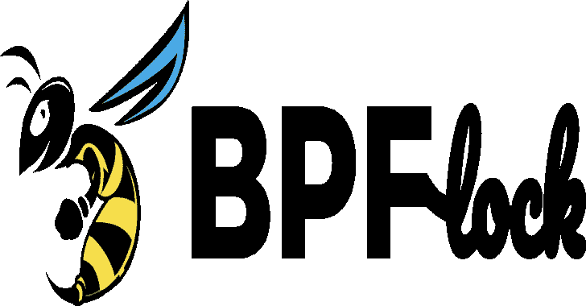

# Bpflock : eBPF 驱动的锁定和审计 Linux 机器的安全性

> 原文：<https://kalilinuxtutorials.com/bpflock/>

.png)

bpflock 使用 eBPF 增强 Linux 安全性。通过限制对各种 Linux 特性的访问，bpflock 能够减少攻击面并阻止一些众所周知的攻击技术。

只有在主机 pid 和网络命名空间中运行的程序，如容器管理器、systemd 和其他容器/程序，才允许访问完整的 Linux 功能，在它们自己的命名空间上运行的容器和应用程序将受到限制。如果 bpflock bpf 程序在`**restricted**`配置文件下运行，那么所有程序/容器，包括特权程序/容器，都将被拒绝访问。

bpflock 通过利用包括 Linux 安全模块+ BPF 在内的多种安全特性来保护 Linux 机器。

架构和安全设计笔记:

*   bpflock 不是一个强制性的访问控制标签解决方案，也不打算取代 AppArmor、SELinux 和其他 MAC 解决方案。bpflock 使用简单的声明性安全配置文件。
*   bpflock 提供了多个小型 bpf 程序，可以在从云原生部署到 Linux 物联网设备的多种上下文中重用。
*   bpflock 能够限制 root 用户访问某些 Linux 特性，但是它不能抵御邪恶的 root 用户。

## 功能概述

### 安全功能

bpflock 提供多种安全保护，可分为:

*   内存保护
    *   内核映像锁定
    *   内核模块保护
    *   BPF 保护
*   过程保护
    *   无文件内存执行
    *   名称空间保护
*   硬件添加攻击
    *   USB 附加保护
*   系统和应用程序跟踪
    *   跟踪应用程序执行
    *   跟踪特权系统操作
*   文件系统保护
    *   只读根文件系统保护
    *   sysfs 保护
*   网络保护
    *   bpflock 未来可能会包括一个简单的网络保护，可用于单机工作负载或 Linux-IoT，但不会包括云原生保护。纤毛和其他 kubernetes CNI 相关的解决方案要好得多。

### 语义学

bpflock 保持了简单的安全语义。它支持三个**全局**配置文件，以广泛覆盖安全谱，并限制对特定 Linux 特性的访问。

*   `**profile**`:这是可应用于每个 bpf 程序的全局配置文件，它采用以下之一:
    *   它们是相同的，它们定义了最不安全的配置文件。在此配置文件中，记录并允许所有进程的访问。有助于记录安全事件。
    *   `**baseline**`:限制性配置文件，除了在主机名称空间中运行的特权应用程序和容器之外，所有进程的访问都被拒绝，或者在`**bpflock_cgroupmap**` bpf 映射中的每个 cgroup 允许的配置文件。
    *   `**restricted**`:高度受限的配置文件，拒绝所有进程的访问。
*   `**Allowed**`或`**blocked**`操作/命令:在`**allow|privileged**`或`**baseline**`配置文件下，可以指定并应用允许或阻止的命令列表。
    *   `**--protection-allow**`:逗号分隔的允许操作列表。在`**baseline**`配置文件下有效，这对于过于特殊和执行特权操作的应用程序非常有用。这将减少对`**allow | privileged**`概要文件的使用，因此我们可以指定`**baseline**`概要文件，并添加一组允许的命令，为这类应用程序提供一个具体情况具体分析的定义，而不是使用`**privileged**`概要文件。
    *   `**--protection-block**`:逗号分隔的被阻止操作列表。在`**allow|privileged**`和`**baseline**`配置文件下有效，它允许在不使用可能会破坏某些特定应用程序的完整`**restricted**`配置文件的情况下限制对某些功能的访问。使用`**baseline**`或`**privileged**`配置文件打开了访问大多数 Linux 特性的大门，但是使用`**--protection-block**`选项可以阻止一些访问。

有关 bpf 安全示例，请查看 bpf 群配置示例

## 部署

### 先决条件

bpflock 需要以下内容:

*   Linux 内核版本> = 5.13，配置如下:

**配置 _ BPF _ 系统调用=y
配置 _ 调试 _ 信息=y
配置 _ 调试 _ 信息 _BTF=y
配置 _KPROBES=y
配置 _LSM="…，bpf"
配置 _BPF_LSM=y**

*   显然是一个支持 BTF 的内核。

#### 启用 BPF LSM 支持

如果您的内核是用`**CONFIG_BPF_LSM=y**`编译的，请检查`**/boot/config-***`以确认，但是当运行 bpflock 时，它会失败，并显示:

**必须有一个'配置 _BPF_LSM=y ' '配置 _LSM=\"…，bpf\"'"** 的内核

然后在 Ubuntu 上启用 BPF·LSM 作为例子:

*   当然，以特权身份打开/etc/default/grub 文件。
*   将以下内容添加到`**GRUB_CMDLINE_LINUX**`变量并保存

**" LSM =锁定、能力、yama、apparmor、bpf"**

或者

**GRUB _ CMDLINE _ LINUX = " LSM = lockdown，capability，yama，apparmor，bpf"**

使用更新 grub 配置

**sudo 更新-grub2**

*   重启进入你的内核。

### Docker 部署

要使用默认的`**allow**`或`**privileged**`配置文件(最不安全的配置文件)运行:

**docker run–name BP flock-it–RM–cgroupns = host \
–PID = host–privileged \
-v/sys/kernel/:/sys/kernel/\
-v/sys/fs/bpf:/sys/fs/bpf Linux lock/BP flock**

### 配置和环境文件

使用以下命令可以将配置作为绑定挂载进行传递。

假设 bpflock.yaml 和 bpf.d 概要文件配置在当前目录下的`**bpflock**`目录中，那么我们可以使用:

**ls bpflo/
bpf . d bpflo . d bpflo . YAML**

**docker run–name BP flock-it–RM–cgroupns = host–PID = host–privileged \
-v $(pwd)/BP flock/:/etc/BP flock \
-v/sys/kernel/:/sys/kernel/\
-v/sys/fs/bpf:/sys/fs/bpf Linux lock/BP flock**

使用`**--env-file**`也可以通过文件传递环境变量。所有参数都可以使用`**BPFLOCK_$VARIABLE_NAME=VALUE**`格式作为环境变量传递。

使用文件中的环境变量运行的示例:

**docker run–name BP flock-it–RM–cgroupns = host–PID = host–privileged \
–env-file BP flock . env . list \
-v/sys/kernel/:/sys/kernel/\
-v/sys/fs/bpf:/sys/fs/bpf Linux lock/BP flock**

## 建设

bpflock 使用 docker BuildKit 进行构建，使用 Golang 进行一些检查和运行测试。bpflock 构建在下载标准 golang 包的 Ubuntu 容器中。

运行以下命令来构建 bpflock docker 容器:

**git 子模块更新–初始化–递归
make**

Bpf 程序是使用 libbpf 构建的。使用的 docker 镜像是 Ubuntu。

如果你只想直接构建 bpf 程序而不使用 docker，那么在 Ubuntu 上:

**sudo apt install-y pkg-config bison binutils-dev build-essential \
flex libc 6-dev clang-12 libllvm 12 llvm-12-dev libclang-12-dev \
zlib 1g-dev libelf-dev libfl-dev gcc-multilinib zlib 1g-dev \
libcap-dev liblibibity-dev libbfd-dev**

[**Download**](https://github.com/linux-lock/bpflock#5-build)