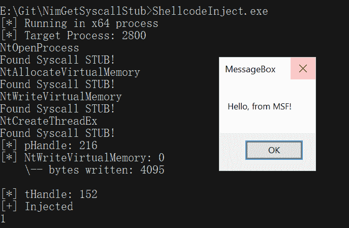

# NimGetSyscallStub:从新的 Ntdll.Dll 副本中获取新的系统调用

> 原文： [https://kalilinuxtutorials.com/nimgetsyscallstub-2/](https://kalilinuxtutorials.com/nimgetsyscallstub-2/)

.png)

NimGetSyscallStub ，从新的 ntdll.dll 副本中获取新的系统调用。这段代码可以作为@ajpc500 或 ParallelNimcalls 已经发布的牛逼工具 NimlineWhispers 和 NimlineWhispers2 的替代。

动态获取系统调用的优点是，存根的签名不包含在文件中，您不必担心更改 Windows 版本。

要编译外壳代码执行模板，请运行以下命令:

nim c -d:释放 ShellcodeInject.nim

结果应该是这样的:

[**Download**](https://github.com/S3cur3Th1sSh1t/NimGetSyscallStub)