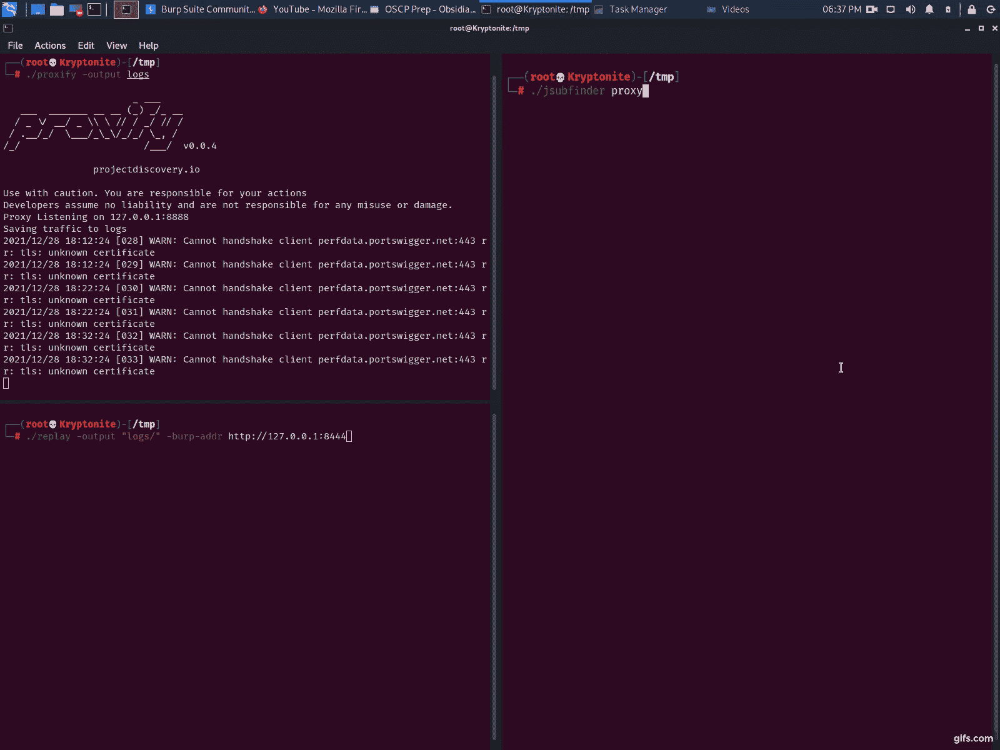

# JSubFinder:在网页中搜索 Javascript 以找到隐藏的子域和秘密

> 原文：<https://kalilinuxtutorials.com/jsubfinder/>

[](https://blogger.googleusercontent.com/img/b/R29vZ2xl/AVvXsEgi20t4XCATEWb-gwCyajSmBHfy8stqoDlTjO7UtsoqrHPtO1nXER3SmTAdu8obT8Nmt6hmyge5oN1qZ62_NAOkMOoip3W6YXg35c7Lv01IcHhJw4iUyMp66fAKCTlFewJkYPg9WKsAEIkyW4u_8oK2JVcvMZug8Qzqlaq3TXXRfVpzrcjkOlB0eb3T/s728/JSubFinder.png)

JSubFinder 是一个用 golang 编写的工具，用于搜索网页& javascript 中给定 URL 中隐藏的子域和秘密。JSubFinder 在开发时就考虑到了 BugBounty hunters，它利用了 Go 惊人的性能，允许它利用大型数据集&轻松地与其他工具链接。



## 安装

安装应用程序并下载寻找秘密所需的签名

#### **使用 GO:**

```
go get github.com/ThreatUnkown/jsubfinder
wget https://raw.githubusercontent.com/ThreatUnkown/jsubfinder/master/.jsf_signatures.yaml && mv .jsf_signatu
```

或者

[下载页面](https://github.com/hiddengearz/jsubfinder/tags)

## **基本用法**

### 搜索

在给定的 url 中搜索子域和机密

```
$ jsubfinder search -h

Execute the command specified

Usage:
  JSubFinder search [flags]

Flags:
  -c, --crawl              Enable crawling
  -g, --greedy             Check all files for URL's not just Javascript
  -h, --help               help for search
  -f, --inputFile string   File containing domains
  -t, --threads int        Ammount of threads to be used (default 5)
  -u, --url strings        Url to check

Global Flags:
  -d, --debug               Enable debug mode. Logs are stored in log.info
  -K, --nossl               Skip SSL cert verification (default true)
  -o, --outputFile string   name/location to store the file
  -s, --secrets             Check results for secrets e.g api keys
      --sig string          Location of signatures for finding secrets
  -S, --silent              Disable printing to the console

```

示例(这种情况下结果相同):

```
$ jsubfinder search -u www.google.com
$ jsubfinder search -f file.txt
$ echo www.google.com | jsubfinder search
$ echo www.google.com | httpx --silent | jsubfinder search$

apis.google.com
ogs.google.com
store.google.com
mail.google.com
accounts.google.com
www.google.com
policies.google.com
support.google.com
adservice.google.com
play.google.com
```

#### 启用秘密

*注意`--secrets=""`会将保密结果保存在一个 secrets.txt 文件中*

```
$ echo www.youtube.com | jsubfinder search --secrets=""
www.youtube.com
youtubei.youtube.com
payments.youtube.com
2Fwww.youtube.com
252Fwww.youtube.com
m.youtube.com
tv.youtube.com
music.youtube.com
creatoracademy.youtube.com
artists.youtube.com

Google Cloud API Key <redacted> found in content of https://www.youtube.com
Google Cloud API Key <redacted> found in content of https://www.youtube.com
Google Cloud API Key <redacted> found in content of https://www.youtube.com
Google Cloud API Key <redacted> found in content of https://www.youtube.com
Google Cloud API Key <redacted> found in content of https://www.youtube.com
Google Cloud API Key <redacted> found in content of https://www.youtube.com
```

#### 高级例子

```
$ echo www.google.com | jsubfinder search -crawl -s "google_secrets.txt" -S -o jsf_google.txt -t 10 -g
```

*   `-crawl`使用默认爬虫抓取网页，以供其他 URL 分析
*   使 JSubFinder 能够搜索秘密
*   `-S`静音输出到控制台
*   `-o <file>`将输出保存到指定文件
*   使用 10 根线
*   在每一个网址中搜索 JS，甚至是我们认为没有的网址

### 代理

使用 TLS MITM 支持启用上游 HTTP 代理。这允许您:

1.  实时浏览站点，让 JSubFinder 实时搜索子域和秘密。
2.  如果需要，在另一台服务器上运行 jsubfinder 来卸载工作负载

```
$ JSubFinder proxy -h

Execute the command specified

Usage:
  JSubFinder proxy [flags]

Flags:
  -h, --help                    help for proxy
  -p, --port int                Port for the proxy to listen on (default 8444)
      --scope strings           Url's in scope seperated by commas. e.g www.google.com,www.netflix.com
  -u, --upstream-proxy string   Adress of upsteam proxy e.g http://127.0.0.1:8888 (default "http://127.0.0.1:8888")

Global Flags:
  -d, --debug               Enable debug mode. Logs are stored in log.info
  -K, --nossl               Skip SSL cert verification (default true)
  -o, --outputFile string   name/location to store the file
  -s, --secrets             Check results for secrets e.g api keys
      --sig string          Location of signatures for finding secrets
  -S, --silent              Disable printing to the console

```

```
$ jsubfinder proxy
Proxy started on :8444
Subdomain: out.reddit.com
Subdomain: www.reddit.com
Subdomain: 2Fwww.reddit.com
Subdomain: alb.reddit.com
Subdomain: about.reddit.com
```

#### 带打嗝套件

1.  配置 Burp Suite 将流量转发到上游代理/(用户选项>连接>上游代理服务器>添加)
2.  在代理模式下运行 JSubFinder

Burp Suite 现在会将通过它代理的所有流量转发到 JSubFinder。JSubFinder 将检索响应，将其返回给 burp，并在另一个线程中搜索子域和秘密。

#### 用 Proxify

1.  启动[Proxify](https://github.com/projectdiscovery/proxify)将流量转储到一个文件夹`proxify -output logs`
2.  配置 Burp Suite、浏览器或其他工具将流量转发给 Proxify(参见其 [github 页面](https://github.com/projectdiscovery/proxify)上的说明)
3.  以代理模式启动 JSubFinder，并将上游代理设置为 Proxify `jsubfinder proxy -u http://127.0.0.1:8443`
4.  使用 Proxify 的重放实用程序重放转储到 jsubfinder 的流量`replay -output logs -burp-addr http://127.0.0.1:8444`

#### 在另一台服务器上运行

很简单，在另一台服务器上以代理模式运行 JSubFinder，比如 192.168.1.2。遵循上面的代理步骤，但是将您的应用程序上游代理设置为 192.168.1.2:8443

#### 高级例子

```
$ jsubfinder proxy --scope www.reddit.com -p 8081 -S -o jsf_reddit.txt
```

*   `--scope`限制 JSubFinder 只分析来自[www.reddit.com](http://www.reddit.com)的响应
*   `-p`端口 JSubFinders 代理服务器正在其上运行
*   `-S`静音输出到控制台/stdout
*   `-o <file>`将示例输出到该文件

[Click Here To Download](https://github.com/ThreatUnkown/jsubfinder)