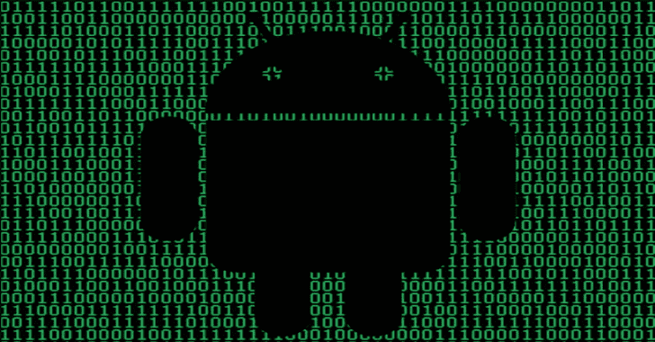

# 切片机:自动化 APK 侦察钻孔过程的工具

> 原文：<https://kalilinuxtutorials.com/slicer-2/>

[](https://blogger.googleusercontent.com/img/b/R29vZ2xl/AVvXsEiLZ37jSOJ6dzZWIr07K0n-mtjGCA_APuMybVW1Y43Wmkv4pRtzyCXD7i8EefLCQIpjgiU-Cz60jV34HknpbbuO-5B3zhwmWB7vfthKL6FN68jvWjTsqXa5TIh8l8Is_HeXxn7T6XlBLjeofKrOrC7mslNtG8yeqVxT9Sa2TrsPsgI4SNdXkxoIKk-_/s728/Slicer.png)

**切片器**是一款自动对 APK 文件进行重组的工具。切片器接受一个路径到一个提取的 APK 文件，然后返回所有的活动、接收者和服务，这些活动、接收者和服务被导出并具有`null`权限，可以被外部激发。

**注意**:APK 必须通过`jadx`或`apktool`提取。

# 摘要

## **为什么？**

我在 3 周前(2020 年 6 月)开始了 bug bounty，我一直在 android 应用上尽我所能。但我注意到一件事，在所有的应用程序中，我在深入研究之前必须做某些事情。所以我想用一个简单的工具来自动化这个过程会很好。

为什么不是德罗泽？

德罗泽是另一种野兽。即使它能找出所有可访问的组件，但我厌倦了一次又一次地运行这些命令。

为什么不使用 drozer 实现自动化？

我实际上写了一个 bash 脚本来运行某些 drozer 命令，这样我就不用手动运行它们了，但是仍然有一些无聊的事情要做。比如检查各种 API 键的`strings.xml`,测试 firebase DB 是否可以公开访问，或者这些 google API 键是否对它们的使用设置了任何限制或其他东西。

为什么不搜索所有文件？

我认为像 grep 或 ripgrep 这样的工具在搜索所有文件时会快得多。因此，如果你想搜索某个特定的东西，最好使用这些工具。但是如果你认为在所有的 android 文件中有一些应该被检查的东西，那么请随意打开一个问题。

# 特性

*   检查 APK 是否已经将`android:allowbackup`设置为`true`
*   检查 APK 是否已经将`android:debuggable`设置为`true`。
*   返回所有已导出且具有空权限集的活动、服务和广播接收器。这是根据两件事决定的:
    *   `android:exporte=true`存在于任何组件中并且没有权限集。
    *   如果没有提到 exported，那么切片器检查是否为该组件定义了任何`Intent-filters`,如果是，这意味着默认情况下该组件被导出(这是 android 文档中给出的规则。)
*   通过测试`.json`技巧来检查 APK 的 Firebase URL。
    *   如果 firebase URL 是`myapp.firebaseio.com`,那么它将检查`https://myapp.firebaseio.com/.json`是否返回了什么或者拒绝了许可。
    *   如果这个东西是开放的，那么可以报告为高严重性。
*   检查 google API 密钥是否可以公开访问。
    *   这可以在一些赏金程序中报告，但严重性较低。
    *   但是很多时候举报这种事情会带出`Duplicate`的痛苦。
    *   有时，公司可以将它作为`not applicable`关闭，并声称该密钥有一个`usage cap`–r/可疑的细节😉
*   返回出现在`strings.xml`和`AndroidManifest.xml`中的其他 API 键
*   列出`/res/raw`和`res/xml`目录中存在的所有文件名。
*   提取所有的 URL 和路径。
    *   这些可以和像 dirsearch 或者 ffuf 这样的工具一起使用。

# 安装

*   克隆此存储库

```
git clone https://github.com/mzfr/slicer
cd slicer
```

现在你可以运行它了:`python3 slicer.py -h`

# 用法

用起来很简单。以下选项可用:

```
Extract information from Manifest and strings of an APK

Usage:
        slicer [OPTION] [Extracted APK directory]

Options:

  -d, --dir             path to jadx output directory
  -o, --output          Name of the output file(not implemented)

```

我还没有实现`output`标志，因为我认为如果你能将切片器的输出重定向到一个 yaml 文件，它将是一个合适的格式。

# 用法举例

*   从 APK 中提取信息并显示在屏幕上。

```
python3 slicer.py -d path/to/extact/apk -c config.json
```

[Click Here To Download](https://github.com/mzfr/slicer)