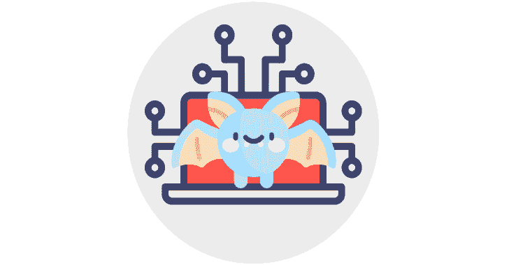

# Autobloody:自动利用 BloodHound 显示的 Active Directory 权限提升路径的工具

> 原文：<https://kalilinuxtutorials.com/autobloody/>

[](https://blogger.googleusercontent.com/img/b/R29vZ2xl/AVvXsEh7cWl56r2h8DBy_HcxWxzaTu1aElg-Vs3aDsV4nRODxfyId17snJbflkl55-vGRyJ9obbT4WHIdglszrNUHgBtSfYSYEgrqezqJ_oIxYIdLMXa6tv4jrsM7eOGWSxTeqrrQo9cY9dnsT7R-9wi-fmL1NM76elorCuYfYS06etmWth81r4AgK7rkPBq/s728/autobloody(1).png)

**Autobloody** 是一款自动利用 BloodHound 显示的 Active Directory 权限提升路径的工具。

## 描述

如果 BloodHound 数据库中存在特权路径，此工具会自动执行两个 AD 对象(源对象(我们拥有的对象)和目标对象(我们想要的对象))之间的 AD 特权。自动化由两个步骤组成:

*   使用 bloodhound 数据和 neo4j 查询查找 privesc 的最佳路径。
*   执行使用`bloodyAD`包找到的路径

因为 autobloody 依赖于 [bloodyAD](https://github.com/CravateRouge/bloodyAD) ，所以它支持使用明文密码、哈希传递、票证传递或证书进行身份验证，并绑定到域控制器的 LDAP 服务以执行 AD 特权。

## 安装

首先，如果您在 Linux 上运行它，您必须在您的操作系统上安装`libkrb5-dev`以便 kerberos 能够工作:

```
# Debian/Ubuntu/Kali
apt-get install libkrb5-dev
# Centos/RHEL
yum install krb5-devel
# Fedora
dnf install krb5-devel
# Arch Linux
pacman -S krb5
```

python 包可用:

```
pip install autobloody
```

或者，您可以克隆回购:

```
git clone --depth 1 https://github.com/CravateRouge/autobloody
pip install .
```

## 依赖关系

*   [血腥镇压](https://github.com/CravateRouge/bloodyAD)
*   Neo4j python 驱动程序
*   Neo4j 与 [GDS 图书馆](https://neo4j.com/docs/graph-data-science/current/installation/)
*   大猎犬
*   python3
*   Gssapi (linux)或 Winkerberos (Windows)

## 如何使用

首先必须将数据导入 BloodHound(例如使用 SharpHound 或 BloodHound.py ),并且 Neo4j 必须正在运行。

⚠️ **-ds 和-dt 值区分大小写**

**简单用法:**

```
autobloody -u john.doe -p 'Password123!' --host 192.168.10.2 -dp 'neo4jP@ss' -ds 'JOHN.DOE@BLOODY.LOCAL' -dt 'BLOODY.LOCAL'
```

**完整帮助:**

```
[bloodyAD]$ ./autobloody.py -h
usage: autobloody.py [-h] [--dburi DBURI] [-du DBUSER] -dp DBPASSWORD -ds DBSOURCE -dt DBTARGET [-d DOMAIN] [-u USERNAME] [-p PASSWORD] [-k] [-c CERTIFICATE] [-s] --host HOST

AD Privesc Automation

options:
  -h, --help            show this help message and exit
  --dburi DBURI         The host neo4j is running on (default is "bolt://localhost:7687")
  -du DBUSER, --dbuser DBUSER
                        Neo4j username to use (default is "neo4j")
  -dp DBPASSWORD, --dbpassword DBPASSWORD
                        Neo4j password to use
  -ds DBSOURCE, --dbsource DBSOURCE
                        Case sensitive label of the source node (name property in bloodhound)
  -dt DBTARGET, --dbtarget DBTARGET
                        Case sensitive label of the target node (name property in bloodhound)
  -d DOMAIN, --domain DOMAIN
                        Domain used for NTLM authentication
  -u USERNAME, --username USERNAME
                        Username used for NTLM authentication
  -p PASSWORD, --password PASSWORD
                        Cleartext password or LMHASH:NTHASH for NTLM authentication
  -k, --kerberos
  -c CERTIFICATE, --certificate CERTIFICATE
                        Certificate authentication, e.g: "path/to/key:path/to/cert"
  -s, --secure          Try to use LDAP over TLS aka LDAPS (default is LDAP)
  --host HOST           Hostname or IP of the DC (ex: my.dc.local or 172.16.1.3)
```

## 它是如何工作的

首先，使用 Neo4j 的 GDS 库中实现的 Dijkstra 算法找到一个 privesc 路径。Dijkstra 算法允许解决加权图上的最短路径问题。默认情况下，BloodHound 创建的边没有权重，只有类型(例如 MemberOf，WriteOwner)。然后，根据边的类型和到达的节点的类型(例如，用户、组、域)，向每个边添加权重。

一旦路径生成，`autobloody`将连接到 DC，执行路径并清理可逆的部分(除了`ForcePasswordChange`和`setOwner`)。

## 限制

目前，只有以下 BloodHound 边缘支持自动利用:

*   MemberOf
*   强制更改密码
*   添加成员
*   AddSelf
*   数据同步
*   GetChanges/GetChangesAll
*   类属的
*   WriteDacl
*   泛型写入
*   写所有者
*   拥有
*   包含
*   所有延伸权利

[Click Here To Download](https://github.com/CravateRouge/autobloody)