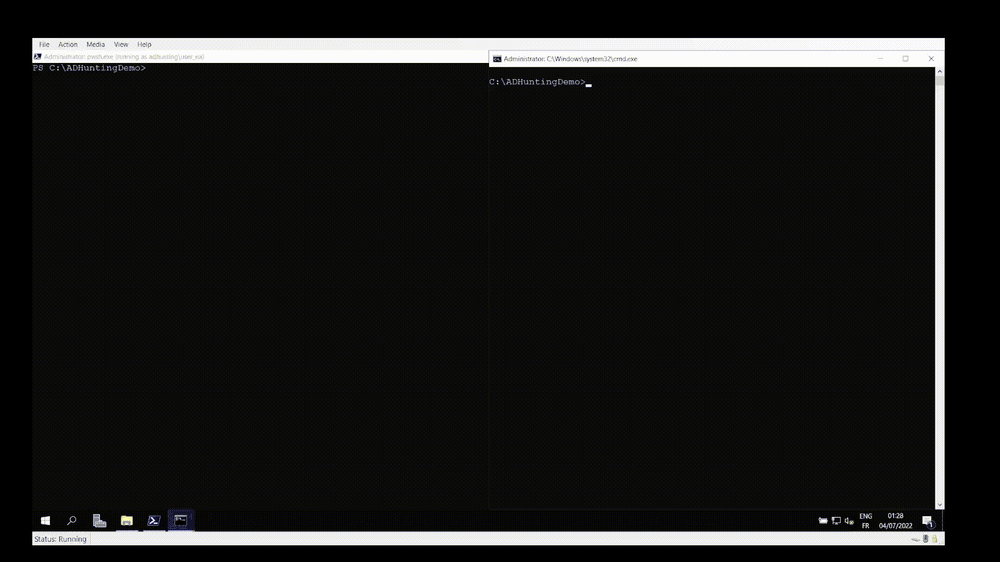
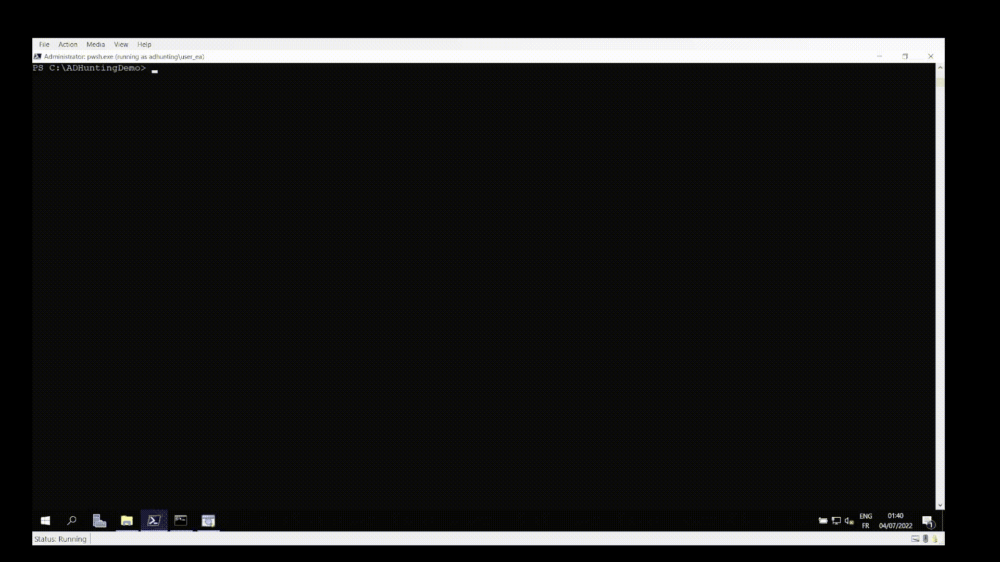

# FarsightAD:旨在帮助揭示(最终)持久性机制的 PowerShell 脚本

> 原文：<https://kalilinuxtutorials.com/farsightad/>

[](https://blogger.googleusercontent.com/img/b/R29vZ2xl/AVvXsEiJ4bLoM6UbnACZ0C1D7f6hJadru7CcQTt-SUql5TOjXggPhIDzjngHBNG0TK-qmAOJdIcq_MHq_m1aO1rTib8SnfKX_ZZKbrw3QZHBPEtKVvltV7eaKpd_U9FHAMeqOoVVxeVx_cpEmBpO9T7xI-XmN7IGGckxFPmFWpoCo9QRfIsDaEQFrpGnd18m/s728/FarsightAD4.png)

**`FarsightAD`** 是一个 PowerShell 脚本，旨在帮助发现(最终)威胁参与者在活动目录域受损后部署持久性机制。

该脚本生成各种对象及其属性的 CSV / JSON 文件导出，并添加了来自复制元数据的时间戳。此外，如果以复制权限执行，`**Directory Replication Service (DRS)**`协议可用于检测完全或部分隐藏的对象。

## 先决条件

`FarsightAD`要求 [`PowerShell 7`](https://docs.microsoft.com/en-us/powershell/scripting/install/installing-powershell-on-windows) 和`ActiveDirectory`模块更新为`PowerShell 7`。

在 Windows 10 / 11 上，模块可以通过`Optional Features`安装为 [`RSAT: Active Directory Domain Services and Lightweight Directory Services Tools`](https://docs.microsoft.com/en-us/troubleshoot/windows-server/system-management-components/remote-server-administration-tools) 。已经安装的模块可以通过以下方式进行更新:

```
**Add-WindowsCapability -Online -Name Rsat.ServerManager.Tools~~~~0.0.1.0**
```

如果模块被正确更新，`Get-Command Get-ADObject`应该返回:

```
**CommandType     Name                                               Version    Source
-----------     ----                                               -------    ------
Cmdlet          Get-ADObject                                       1.0.X.X    ActiveDirectory**
```

## 基本用法

```
**. .\FarsightAD.ps1

Invoke-ADHunting [-Server <DC_IP | DC_HOSTNAME>] [-Credential <PS_CREDENTIAL>] [-ADDriveName <AD_DRIVE_NAME>] [-OutputFolder <OUTPUT_FOLDER>] [-ExportType <CSV | JSON>]**
```

## AD 猎 cmdlets

| Cmdlet | 摘要 |
| --- | --- |
| `Invoke-ADHunting` | 执行所有的远视广告搜索 cmdlets(下面提到的)。 |
| `Export-ADHuntingACLDangerousAccessRights` | 导出所有域对象上的危险 ACE，即允许接管底层对象的 ACE。

在较大的域上可能需要一段时间。 |
| `Export-ADHuntingACLDefaultFromSchema` | 导出在模式类的 defaultSecurityDescriptor 属性中配置的 ACL。

识别非默认(如微软文档中所定义)ACL，并突出显示潜在危险的 ace。 |
| `Export-ADHuntingACLPrivilegedObjects` | 导出在域中特权对象上配置的 ACL，并突出显示潜在的危险访问权限。 |
| `Export-ADHuntingADCSCertificateTemplates` | 导出证书模板上的信息和访问权限。

检索以下值得注意的参数:证书模板发布状态、证书使用、主题是否由用户提供的数据构建，以及访问控制(注册/修改)。 |
| `Export-ADHuntingADCSPKSObjects` | 导出敏感 PKS 对象的信息和访问权限(NTAuthCertificates、certificationAuthority 和 pKIEnrollmentService)。 |
| `Export-ADHuntingGPOObjectsAndFilesACL` | 导出 GPO 对象和文件的 ACL 访问权限信息，突出显示 GPO 应用于特权用户或计算机。 |
| `Export-ADHuntingGPOSettings` | 导出由 GPO 配置的可用于持久性的各种设置的信息(特权和登录权限、受限组成员身份、计划和即时任务 V1 / V2、计算机和用户登录/注销脚本)。 |
| `Export-ADHuntingHiddenObjectsWithDRSRepData` | 导出可通过复制(使用目录复制服务(DRS)协议)访问但不能通过直接查询访问的对象属性。

复制操作不考虑访问控制，这允许识别阻止访问特定对象属性的访问控制。

只评估有限的一组敏感属性。 |
| `Export-ADHuntingKerberosDelegations` | 导出被视为危险的 Kerberos 委托(不受约束、受限于特权服务或受限于特权服务的基于资源的委托)。 |
| `Export-ADHuntingPrincipalsAddedViaMachineAccountQuota` | 导出由非特权主体添加到域中的计算机(使用 ms-DS-machineaccountoquota 机制)。 |
| `Export-ADHuntingPrincipalsCertificates` | 导出已解析帐户的证书(对于具有非空 userCertificate 属性的帐户)。

解析证书以检索多个参数:证书有效性时间戳、证书目的、证书主题和最终主题名称，… |
| `Export-ADHuntingPrincipalsDontRequirePreAuth` | 导出不需要 Kerberos 预认证的帐户。 |
| `Export-ADHuntingPrincipalsOncePrivileged` | 导出曾经是特权组成员的帐户。 |
| `Export-ADHuntingPrincipalsPrimaryGroupID` | 导出具有非默认 primaryGroupID 属性的帐户，突出显示链接到特权组的 RID。 |
| `Export-ADHuntingPrincipalsPrivilegedAccounts` | 导出特权组成员的详细信息。 |
| `Export-ADHuntingPrincipalsPrivilegedGroupsMembership` | 导出特权组的当前和过去成员，使用复制元数据检索。 |
| `Export-ADHuntingPrincipalsSIDHistory` | 导出具有非空 SID 历史属性的帐户，解析相关域并突出显示特权 SID。 |
| `Export-ADHuntingPrincipalsShadowCredentials` | 导出解析的密钥凭据信息(具有非空 msDS-KeyCredentialLink 属性的帐户的信息)。 |
| `Export-ADHuntingPrincipalsTechnicalPrivileged` | 导出技术特权帐户(服务器 _ 信任帐户和域间 _ 信任帐户)。 |
| `Export-ADHuntingPrincipalsUPNandAltSecID` | 导出定义 UserPrincipalName 或 AltSecurityIdentities 属性的帐户，突出显示潜在的异常。 |
| `Export-ADHuntingTrusts` | 导出林中所有域的信任。

为每个信任检索多个参数:瞬时性、SID 过滤、TGT 委托。 |

关于每个 cmdlet 用法的更多信息可以使用`Get-Help -Full <CMDLET>`来检索。

## 演示

#### 完全/部分隐藏物体检测


**Adding a fully hidden user**



**Hiding the SID History attribute of an user**



**Uncovering the fully and partially hidden users with Export-ADHuntingHiddenObjectsWithDRSRepData**

## 承认

*   用于`DRS`请求的`C#`代码改编自:
    *   [`MakeMeEnterpriseAdmin`](https://github.com/vletoux/MakeMeEnterpriseAdmin) 的缩写为@ invalux。
    *   [`Mimikatz`](https://github.com/gentilkiwi/mimikatz) 作者@ gentilkiwi 和@vletoux。
    *   [`SharpKatz`](https://github.com/b4rtik/SharpKatz) by @b4rtik。
*   解析密钥凭证的函数来自 [`ADComputerKeys PowerShell module`](https://www.powershellgallery.com/packages/ADComputerKeys/1.0.0/Content/ADComputerKeys.psm1) 。
*   与 AD CS 相关的持久性基于以下工作:
    *   [Will Schroeder(@ harmj 0y)和 Lee Christensen (@tifkin_)认证的二手车](https://posts.specterops.io/certified-pre-owned-d95910965cd2)
    *   [微软 ADCS-在活动目录环境中滥用 PKI](https://www.riskinsight-wavestone.com/en/2021/06/microsoft-adcs-abusing-pki-in-active-directory-environment/)作者 Jean Marsault (@iansus)
*   解析服务主体名称的函数基于 Adam Bertram 的工作。

## 谢谢

*   Antoine Cauchois (@caucho_a)的校对、测试和想法。

[Click Here To Download](https://github.com/Qazeer/FarsightAD)