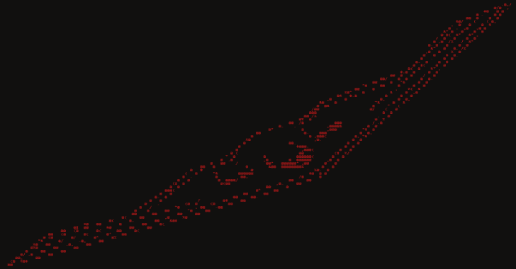

# 空袭:自动抓取和破解分布式客户端-服务器架构的 WPA-2 握手

> 原文：<https://kalilinuxtutorials.com/airstrike/>

**AirStrike** 是一款使用客户端-服务器架构自动破解 WPA-2 Wi-Fi 凭证的工具。

**要求**

Airstrike 使用 Hashcat Brain 架构、`**aircrack-ng**` suite、`**entr**` utility 和一些辅助脚本。

你可以使用 **`install.sh`** 脚本下载所有的依赖项(如果你在可以访问 apt 或 pacman 的系统上，但是如果你使用 Gentoo，你必须手动安装 hcxtools，它们在它们的 repos 中不可用，或者我可能错过了什么。其他一些不常见的发行版没有包括在内，例如 Alpine 没有 hashcat 包，但是如果你的发行版是外来的，你可以在上面使用 Nix，所有需要的包都在 nixpkgs 中。)

如果您使用的是 Nix/NixOS，那么您可以使用`**nix-shell -p hashcat hashcat-utils aircrack-ng entr hcxtools**`跳转到 Nix-Shell 并获得所需的依赖项

**用法**

在你想破解密码的机器上运行`**aircrack_server.sh**`。这个脚本构建了`**aircrack_client.sh**`文件，它可以在任何能够连接到之前启动的服务器的 Linux 主机上执行。在执行时，客户端自动捕获握手，与服务器连接并发送捕获的数据。

每当服务器成功破解一个密码时，`**watcher.sh**`脚本会将它打印到服务器端的终端上。

`**airstrike_client.sh**`唯一需要的选项标志是`**-w**`标志:它指定了服务器应该使用的单词表。监听接口可以用`**-i**`标志指定。默认情况下，会自动选择当前的无线接口。此外，`**airstrike_client.sh**`在没有任何过滤器的情况下监听 WPA-2 数据，因此它将捕获并破解范围内所有 Wi-Fi 网络的所有密码(每当交换握手时)。

**导航**

`**Ctrl + S**`会将捕获的资产(以`**.hccapx**`形式的 Wi-Fi 握手)发送到服务器。`**Ctrl + I**`显示捕获进度信息。

以上快捷方式可以在`**airstrike_client.sh**`的运行实例中使用

[**Download**](https://github.com/redcode-labs/AirStrike)