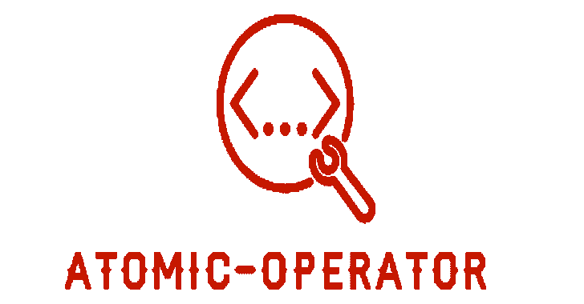

# Atomic-Operator:Python 包用于执行原子红队测试

> 原文：<https://kalilinuxtutorials.com/atomic-operator/>

[](https://blogger.googleusercontent.com/img/b/R29vZ2xl/AVvXsEh9GQ-W6kKgnxv2pfWv074wGSmee4D0JOcWp55oRs5k9DdycQ0EZ1DgGFwqJ8zxBTvD8cqR44x0it2DdIbU8ihnWfheHRklWqk1xMtoXER8wGvwKL88bsnqslTpcK8uUtX2Qm3Go3-s5Po05wnpBbYTTQIwTQFF9_9fGYs6JoBCWS1dMyub1XKplWux/s728/atomic-operator-logo-svg%20(3).png)

使安全专业人员能够根据 atomic-red-team 中定义的规定技术测试他们的检测和防御能力。通过利用诸如`**atomic-operator**`这样的测试框架，您可以识别您的防御能力以及防御覆盖范围中的差距。

此外，`**atomic-operator**`还可以用于许多其他情况，例如:

*   生成警报以测试产品
*   测试 EDR 和其他安全工具
*   从对手的角度识别执行防御性规避的方法
*   再加上更多。

## 特性

*   支持在 Windows、macOS 和 Linux 系统上本地和远程执行 Atomic Red Teams 测试
*   支持针对`**iaas:aws**`运行原子测试
*   可以提示输入参数，但不是必需的
*   协助下载原子红队库
*   可以基于配置文件进一步自动化
*   命令行和可导入的 Python 包
*   当指定了一种或多种技术时，选择特定的测试
*   加上更多

## 开始使用

`**atomic-operator**`是一个托管在 PyPi 上的纯 Python 包，支持 Python 3.6 及更高版本。

如果您想要 PowerShell 版本，请查看 Invoke-AtomicRedTeam

**pip 安装原子操作符**

接下来的步骤将指导您设置和运行`**atomic-operator**`。

*   获取原子安装/克隆原子红队仓库
*   原子操作符理解原子操作符中可用的选项
*   在命令行上运行测试或在脚本中运行测试
*   通过配置文件运行测试

## 安装

你可以在 OS X、Linux 或 Windows 上安装原子操作符。您也可以直接从源代码安装它。要安装，请参见下面相关操作系统标题下的命令。

### 先决条件

atomic-operator 需要并安装以下库:

**pyyaml = = 5 . 4 . 1
fire = = 0 . 4 . 0
requests = = 2 . 26 . 0
attrs = = 21 . 2 . 0
pick = = 1 . 2 . 0**

macOS、Linux 和 Windows:

**pip 安装原子操作符**

使用 M1 处理器的 macOS

**git 克隆 https://github.com/swimlane/atomic-operator.git
CD 原子操作符
满足 ModuleNotFoundError:没有名为“setuptools_rust”的模块
brew install rust
pip 3 install–upgrade pip
pip 3 install setup tools _ rust
回到我们定期安排的编程。。。
pip install-r requirements . txt
python setup . py install**

从源安装

**git 克隆 https://github.com/swimlane/atomic-operator.git
CD 原子操作符
pip install-r requirements . txt
python setup . py install**

## 用法示例(命令行)

您可以从命令行或者在您自己的 Python 脚本中运行`**atomic-operator**`。要在命令行中使用`**atomic-operator**`,只需在终端中输入以下内容:

原子操作员-帮助
原子操作员运行-帮助

### 检索原子测试

为了使用`**atomic-operator**`,您必须在本地系统上有一个或多个原子红队测试(Atomics)。`**atomic-operator**`为您提供下载原子红队库的能力。您可以通过在命令行运行以下命令来实现这一点:

**原子运算符 get_atomics
您可以使用–destination 标志
原子运算符 get _ atomics–destination "/tmp/some _ directory "**来指定目标目录

### 在本地运行测试

为了运行测试，您必须提供一些额外的属性(如果需要，还可以提供选项)。运行测试的主要方法名为`**run**`。

**这将运行与您的本地操作系统兼容的所有测试
atomic-operator run–atomics-path "/tmp/some _ directory/redcanary co-atomic-red-team-3700624 "**

当您提供一个或多个特定的技术时，您可以选择单独的测试。例如，在命令行上运行以下命令:

**原子操作员运行–技术 t 1564.001–选择测试**

将提示用户与该技术相关的测试的选择列表。用户可以通过使用空格键突出显示所需的测试来选择一个或多个测试:

### 附加参数

您可以通过运行以下命令查看其他参数:

```
atomic-operator run -- --help
```

| 参数名称 | 类型 | 默认 | 描述 |
| --- | --- | --- | --- |
| 技术 | 目录 | 全部 | 由 attack_technique ID 定义的一个或多个技术。 |
| 测试 guids | 目录 | 没有人 | 一个或多个原子测试 GUIDs。 |
| 选择 _ 测试 | 弯曲件 | 错误的 | 指定技术时，选择一个或多个要运行的原子测试。 |
| 原子 _ 路径 | 潜艇用热中子反应堆（submarine thermal reactor 的缩写） | os.getcwd() | 原子测试之路。 |
| 检查 _ 先决条件 | 弯曲件 | 错误的 | 是否检查先决条件依赖项(prereq_comand)。 |
| get _ 先决条件 | 弯曲件 | 错误的 | 是否要检索先决条件。 |
| 清除 | 弯曲件 | 错误的 | 是否要运行清理命令。 |
| 复制源文件 | 弯曲件 | 真实的 | 您是否想要复制任何相关的源(src、bin 等。)文件复制到远程主机。 |
| 命令超时 | （同 Internationalorganizations）国际组织 | Twenty | 超时前每个命令的持续时间。 |
| 调试 | 弯曲件 | 错误的 | 是否要输出正在运行的测试的详细信息。 |
| 提示输入参数 | 弯曲件 | 错误的 | 是否要提示每个测试的输入参数。 |
| 返回 _ 原子 | 弯曲件 | 错误的 | 是否要返回原子而不是运行它们。 |
| 配置文件 | 潜艇用热中子反应堆（submarine thermal reactor 的缩写） | 没有人 | 在环境中用于自动化原子操作符的配置文件的路径。 |
| 仅配置文件 | 弯曲件 | 错误的 | 是否希望仅基于提供的 config_file 运行测试。 |
| 主机 | 目录 | 没有人 | 要运行测试的一台或多台远程主机的列表。 |
| 用户名 | 潜艇用热中子反应堆（submarine thermal reactor 的缩写） | 没有人 | 用于远程连接身份验证的用户名。 |
| 密码 | 潜艇用热中子反应堆（submarine thermal reactor 的缩写） | 没有人 | 用于远程连接身份验证的密码。 |
| ssh_key_path | 潜艇用热中子反应堆（submarine thermal reactor 的缩写） | 没有人 | 用于远程连接身份验证的 SSH 密钥的路径。 |
| 私有密钥字符串 | 潜艇用热中子反应堆（submarine thermal reactor 的缩写） | 没有人 | 用于远程连接身份验证的私有 SSH 密钥字符串。 |
| 验证 _ssl | 弯曲件 | 错误的 | 通过 RDP 连接时是否验证 SSL(windows)。 |
| 体育 | （同 Internationalorganizations）国际组织 | Twenty-two | 用于远程连接身份验证的 SSH 端口。 |
| ssh_timeout | （同 Internationalorganizations）国际组织 | five | 远程连接身份验证的 SSH 超时。 |
| **kwargs | 词典 | 没有人 | 如果额外的标志被传递到 run 命令中，那么我们将尝试将它们与原子测试中定义的输入进行匹配，并用提供的值替换它们的值。 |

您应该会看到与下面类似的输出:

**NAME
Atomic-operator run——我们运行 Atomic Red 团队测试的主要方法。
简介
原子操作员运行
描述
我们运行原子红队测试的主要方法。
FLAGS
–TECHNIQUES = TECHNIQUES
Type:list
Default:[' all ']
一个或多个由 attack_technique ID 定义的技术。默认为“全部”。
–TEST _ GUIDS = TEST _ GUIDS
类型:list
默认值:[]
一个或多个原子测试 guid。默认为无。
–SELECT _ TESTS = SELECT _ TESTS
Type:bool
Default:False
从提供的技术中选择一个或多个测试。默认为 False。
–ATOMICS _ PATH = ATOMICS _ PATH
默认:'/U…
原子测试的路径。默认为 os.getcwd()。
–CHECK _ PREREQS = CHECK _ PREREQS
默认值:False
是否检查先决条件依赖项(prereq_comand)。默认为 False。
–GET _ PREREQS = GET _ PREREQS
Default:False
是否要检索先决条件。默认为 False。
–clean up = clean up
Default:False
是否要运行清理命令。默认为 False。
–COPY _ SOURCE _ FILES = COPY _ SOURCE _ FILES
默认值:True
是否要复制任何相关的源文件(src、bin 等。)文件复制到远程主机。默认为真。
–COMMAND _ time out = COMMAND _ time out
默认值:每个命令的 20
超时持续时间。默认为 20。
–DEBUG = DEBUG
Default:False
是否要输出正在运行的测试的详细信息。默认为 False。
–PROMPT _ FOR _ INPUT _ args = PROMPT _ FOR _ INPUT _ ARGS
默认值:False
是否要提示每次测试的输入参数。默认为 False。
–RETURN _ ATOMICS = RETURN _ ATOMICS
默认值:False
是否要返回原子而不是运行它们。默认为 False。
–CONFIG _ FILE = CONFIG _ FILE
Type:Optional[]
Default:None
coni fg _ FILE 的路径，用于在环境中自动执行原子操作符。默认为无。
–config_file _ ONLY = CONFIG _ FILE _ ONLY
默认值:False
是否希望仅基于提供的 CONFIG _ FILE 运行测试。默认为 False。
–HOSTS = HOSTS
默认值:[]
要运行测试的一个或多个远程主机的列表。默认为[]。
–用户名=用户名
类型:可选[]
默认:无
用于远程连接认证的用户名。默认为无。
–PASSWORD = PASSWORD
Type:Optional[]
默认值:None
用于远程连接认证的密码。默认为无。
–ssh _ KEY _ PATH = SSH _ KEY _ PATH
Type:Optional[]
Default:None
用于远程连接认证的 SSH 密钥的路径。默认为无。
–PRIVATE _ KEY _ STRING = PRIVATE _ KEY _ STRING
Type:Optional[]
默认值:None
用于远程连接认证的私有 SSH 密钥字符串。默认为无。
–VERIFY _ SSL = VERIFY _ SSL
默认值:False
通过 RDP 连接时是否验证 SSL(windows)。默认为 False。
–ssh _ PORT = SSH _ PORT
默认:22
用于远程连接认证的 SSH 端口。默认为 22。
–ssh _ time out = SSH _ time out
默认值:5
远程连接认证的 SSH 超时。默认为 5。
接受附加标志。**
**如果提供，匹配测试输入的键将被替换。默认值为无。**

### 使用配置文件运行原子运算符

除了用`**atomic-operator**`传递参数的能力之外，您还可以传递一个到包含所有原子测试及其潜在输入的`**config_file**`的路径。您可以在此处看到此配置文件的示例:

**atomic _ tests:
guid:f7e 6 EC 05-c19e-4a 80-a7e 7-241027992 fdb
input _ arguments:
output _ file:
value:custom _ output . txt
input _ file:
value:custom _ input . txt
guid:3 ff 64 f 0 b-3af 2-3866-339d-38d 9791407 C3** 

## 用法示例(脚本)

**从 atomic_operator 导入 atomic operator
operator = atomic operator()
这将下载 atomic-red-team 存储库的本地副本
print(operator . get _ atomics('/tmp/some _ directory ')
这将在您的本地系统上运行测试
operator . run(
technique:str = ' All '，
atomics_path=os.getcwd()，
check_dependencies=False，
get_prereqs=False，【T10**

[**Download**](https://github.com/swimlane/atomic-operator)