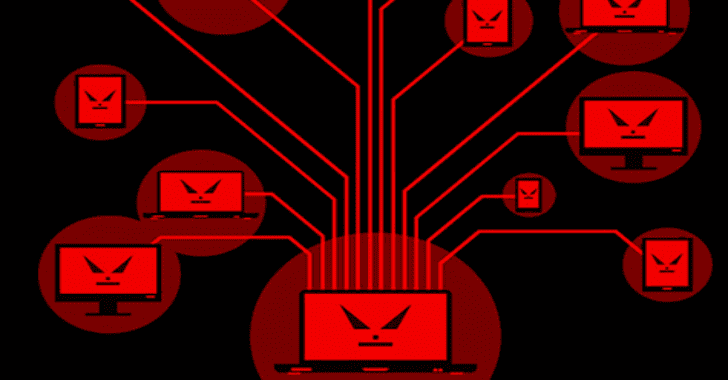

# Aura 僵尸网络:一个超级便携的僵尸网络框架，带有基于 Django 的 C2 服务器

> 原文：<https://kalilinuxtutorials.com/aura-botnet-django-based-c2-server/>

Aura 僵尸网络是一个超级可移植的僵尸网络框架，拥有基于 Django 的 C2 服务器。客户端用 C++编写，备用客户端用 Rust、Bash 和 Powershell 编写。

僵尸网络的 C2 服务器利用 Django 框架作为后端。它远非最高效的 web 服务器，但以下内容弥补了这一点:

*   Django 非常便携，因此非常适合测试/教育目的。服务器和数据库包含在 aura-server 文件夹中。
*   Django 包括一个非常直观和强大的管理网站，可以用来管理机器人和命令
*   服务器只处理简单的 POST 请求和返回文本
*   静态文件应该由擅长处理静态文件的单独的 web 服务器(本地或远程)来处理，比如 nginx

设置超级用户后，可以访问位于 http://your _ server:server _ port/admin 的管理站点(见下文)。

**也可阅读-[Stegify:用于 LSB 隐写术的 Go 工具，能够隐藏图像中的任何文件](https://kalilinuxtutorials.com/stegify-lsb-steganographycapable-hiding-file-within-image/)**

**数据库**

C2 服务器目前配置为使用 SQLite3 数据库 bots.sqlite3，目前的配置可以在 aura-server/aura/settings.py 中更改，你可能希望使用 MySQL，甚至 PostgreSQL 来代替；由于 Django 的可移植数据库 API，这很容易做到。

**僵尸客户端**

主客户端是用 C++编写的，可以使用 CMake 为 Linux 或 Windows 编译。替代客户端是用 Rust、Bash 和 Powershell 编写的，但可能缺少某些功能，因为它们大多不受支持。我会修复任何引起我注意的主要错误，但它们暂时仍会缺乏某些功能，例如在不同的 shells 中运行命令。

客户端将收集相关的系统信息，并将其发送到 C2 服务器以注册新的机器人。身份识别是通过最初创建一个包含随机数据的文件(在整个代码中称为 auth 文件)来完成的，该文件将在每次客户端运行时进行哈希处理，以识别客户端并通过 C2 服务器进行身份验证。然后，它将在代码中指定的文件夹中安装所有文件，并初始化系统服务，或者使用与运行客户端相同的权限来调度任务。默认设置将客户端和其他文件伪装成配置文件。

**其他注释**

因为这是出于测试目的，所以 C2 服务器需要硬编码到客户端和 web 交付文件中。它当前在所有文件上都设置为 *localhost* 。这是因为实际的僵尸网络会使用类似于域生成算法(DGA)的东西来同步客户端上不断变化的域流和正在注册的一次性域流——或者像最初的 Mirai 未来组合僵尸网络一样真正防弹的主机。

代码也没有混淆，也没有任何防止逆向工程的努力；这将违背作为测试和演示僵尸网络的目的。

在您的设备上测试时， *killswitch* 文件夹包含用于轻松移除客户端的脚本。

[**Download**](https://github.com/watersalesman/aura-botnet)