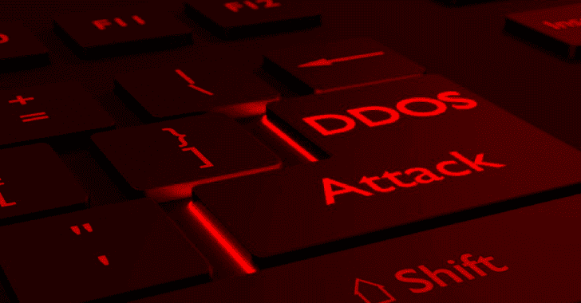

# bonesi:DDoS 僵尸网络模拟器工具

> 原文：<https://kalilinuxtutorials.com/bonesi-ddos-botnet-simulator-2/>

**BoNeSi** ，DDoS 僵尸网络模拟器是一款在测试环境中模拟僵尸网络流量的工具。它旨在研究 DDoS 攻击的影响。

**能产生什么流量？**

**BoNeSi** 从定义的僵尸网络规模(不同的 IP 地址)生成 ICMP、UDP 和 TCP (HTTP)洪流攻击。 **BoNeSi** 高度可配置，速率、数据量、源 IP 地址、URL 和其他参数都可以配置。

**它与其他工具有什么不同？**

有很多其他工具可以用 UDP 和 ICMP 欺骗 IP 地址，但是对于 TCP 欺骗，没有解决方案。 **BoNeSi** 是第一个模拟大规模 bot 网络 HTTP-GET 洪水的工具。 **BoNeSi** 也尽量避免生成具有易识别模式的数据包(很容易被过滤掉)。

**也可阅读-[RapidScan:多工具网络漏洞扫描器](https://kalilinuxtutorials.com/rapidscan-web-vulnerability-scanner/)**

哪里可以跑 BoNeSi？

我们强烈建议在封闭的测试环境中运行 BoNeSi。然而，UDP 和 ICMP 攻击也可以在互联网上运行，但你应该小心。HTTP-Flooding 攻击不能在互联网上模拟，因为来自网络服务器的回答必须被路由回运行 **BoNeSi** 的主机。

**TCP 欺骗是如何工作的？**

B **oNeSi** 嗅探网络接口上的 TCP 数据包，并对所有数据包做出响应，以便建立 TCP 连接。对于这个特性，有必要将来自目标 web 服务器的所有流量路由回运行 **BoNeSi** 的主机

博内西的表现有多好？

为了模拟大型僵尸网络，我们非常关注性能。在主频为 2Ghz 的 AMD Opteron 上，我们每秒能够生成高达 150，000 个数据包。在最新的 3.3 GHz AMD Phenom II X6 1100t 上，您可以生成 300，000 pps(在 2 个内核上运行)。

BoNeSi 攻击成功了吗？

是的，他们非常成功。UDP/ ICMP 攻击可以很容易地填满带宽，而 HTTP-Flooding 攻击可以很快摧毁 web 服务器。我们还针对最先进的商业 DDoS 缓解系统测试了 **BoNeSi** ,以及在哪里能够使它们崩溃或隐藏攻击而不被检测到。

**安装**

**:~$。/configure
:~ $ make
:~ $ make install**

**用途**

:~$ bonesi [OPTION…]

**选项:** 
-i，–IPS = FILENAME FILENAME with IP list
-p，–protocol = PROTO UDP(默认)，icmp 或 tcp
-r，–send _ rate = NUM packets per second，0 = infinite(默认)
-s，–payload _ SIZE = paylod 的大小，(默认:32)
-o，–stats _ file = FILENAME FILENAME 进行统计，(默认:' stats ')【统计】。 0 =无限(默认)
–整数 IP 是按主机字节顺序排列的整数，而不是用点符号表示的整数
-t，–max _ bots = NUM 随机确定 24 位前缀中的 max _ bots(1-256)
-u，–URL = URL URL(默认:'/')(仅适用于 tcp/http)
-l，–URL _ list = FILENAME FILENAME with URL list(仅适用于 tcp/http)
-b，–user agent _ list = FILENAME FILENAME 目前仅在使用 TCP 时。
-f，–frag = NUM 设置碎片模式(0=IP，1=TCP，默认值:0)。目前仅在使用 TCP 时。
-v，–详细打印附加调试信息
-h，–帮助打印帮助信息并退出

**视频教程**

[https://www.youtube.com/embed/ocjKGM3PxJI?feature=oembed&enablejsapi=1](https://www.youtube.com/embed/ocjKGM3PxJI?feature=oembed&enablejsapi=1)

[**Download**](https://github.com/Markus-Go/bonesi)