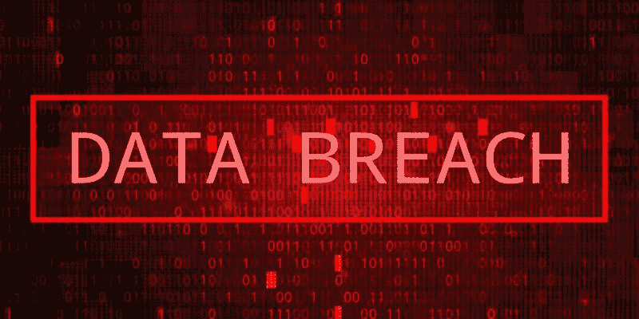

# 数据泄露不会消失:保护业务所需的一切

> 原文：<https://kalilinuxtutorials.com/data-breaches-arent-going-away-everything-you-need-to-know-to-protect-your-business/>

尽管大约每个月都会有重大网络攻击成为头条新闻，但在保护自己免受在线恶意实体攻击方面，一些企业远远落后于形势。

难怪黑客很容易攻破普通组织——仅 2021 年 6 月就发生了 [106 起数据泄露](https://www.itgovernance.co.uk/blog/list-of-data-breaches-and-cyber-attacks-in-june-2021-9-8-million-records-breached),导致 980 万条记录暴露。这意味着，如果一家公司在安全方面投资不足，它很有可能会面临数据泄露，或者会因合作伙伴组织的数据泄露而受到损害。

随着数据泄露数量的不断增加，企业不仅要了解泄露的影响和规模，还要投资于 IT 专家，如 [EC-MSP](https://www.ecmsp.co.uk/managed-it-services-london.php) 以保持领先。

以下是您需要了解的关于数据泄露的一切，包括它们是如何产生的以及您的企业如何最好地避开它们。

## **3 种类型的违规:物理、窃取和电子**

IT 专家将[数据泄露](https://www.forbes.com/sites/chuckbrooks/2021/03/02/alarming-cybersecurity-stats-------what-you-need-to-know-for-2021/)分为三大类:物理的、窃取的和电子的。

虽然它们有相似的风险和后果，但在执行上却大不相同。认识到数据泄露之间的差异至关重要，因为它们需要独特的对策(例如，文档粉碎)来维护数据安全。

### **物理**

物理违规包括设备或包含持卡人数据的文件的物理盗窃；例如，文件、POS 系统和持卡人收据。被认为是一种形式的[商业间谍](https://www.wired.com/story/the-murky-merits-of-a-private-spy-registry/)，有风险的物品包括外部硬盘、笔记本电脑和台式机。

通过访问控制和安全措施可以防止这种攻击。值得注意的是，一旦存储驱动器不再使用，您就应该将其销毁或擦除。

堆积在存储中的旧计算机和被遗忘的硬盘很容易受到物理破坏，并且在被盗时通常不会被注意到。

### **略读**

这种类型的攻击包括记录和捕获磁条卡(如安全访问卡或信用卡)背面的磁性存储数据。这个过程涉及到一个外部设备，罪犯在他们不知情的情况下安装在商家的销售点(POS)上。

有时，恶意员工可以使用外部设备从卡的磁条上获取数据。然后，这些窃贼收集数据，并利用这些数据制造伪造的借记卡和信用卡。

降低撇除可能性的一些准则包括:

*   当员工经常在持卡人看不到的地方持有信用卡时，密切监控卡的处理
*   定期检查设备的撇除装置或防篡改装置
*   通过联系您的卡处理服务提供商，确保您没有使用易受影响的销售点终端

### **电子**

电子违规表示对处理、传输或存储用户数据的网络或系统环境的蓄意攻击或未经授权的访问。这可能是通过应用程序级攻击，通过网站或 web 服务器获得对系统脆弱性的访问权限的结果。

例如，由于访问这些网络会暴露患者的账单数据，因此违规行为经常以医疗保健行业为目标。专家建议企业加密他们的数据，使其在未经授权的情况下难以破译。

加密适用于活动计算机上的文件，但在处置电子设备之前，必须粉碎硬盘并销毁电子介质。

记住:破解加密是可能的，但粉碎的驱动器不能暴露任何东西。

## **数据泄露的来源**

虽然违规很难预防，但这并不意味着它们很难预测。

几乎所有事故都是由以下原因引起的:

### **被盗和脆弱的凭证**

被盗密码是最常见也是最简单的违规来源之一。毕竟，许多用户对他们所有的密码使用相同的可预测短语，这意味着罪犯不必费力获取敏感信息。

黑客甚至可以使用运行流行凭证的计算机程序破解中等安全的密码。因此，您必须仔细考虑您的密码。如果你把密码写在某个地方，或者对许多账户使用类似的短语，你同样容易受到影响。

### **恶意软件**

恶意软件显示了网络犯罪是多么简单。

在这种情况下，犯罪分子购买恶意软件，找到具有已知易感性的系统，并在安装恶意软件后获得回报。

奖励将取决于恶意软件的类型。它可以从键盘记录器(跟踪用户输入的内容)到勒索软件，锁定他们的系统，并要求用户付费才能重新访问。仅暗网市场就包含数以千计的非法恶意软件解决方案出售，并且可以相对容易地访问(然而，我们不建议这样做，因为你自己也很可能收到恶意软件！)

### **未授权使用**

组织经常忽视他们自己的人员带来的威胁。然而，[12](https://www.itgovernance.eu/blog/en/the-6-most-common-ways-data-breaches-occur)起违规事件中有 1 起源于员工不当使用数据——这种可能性应该引起重视。

这有两种主要方式:

#### **特权滥用或误用**

第一种是滥用特权，即员工滥用他们可以合法访问的信息。这不一定是出于恶意；这个工人可能偶然发现了这个信息。如果组织缺乏正确设置的访问控制，就会出现这种情况。或者，工作人员可能会忽略访问策略。例如，当工作人员没有采用适当的程序就修改文档时，就会发生这种情况。

#### **数据处理不当**

第二种常见的权限滥用是数据错误处理，即未经授权的员工复制、共享和访问敏感信息。

### **应用程序漏洞**

所有软件都具有技术敏感性，犯罪分子可以通过各种方式加以利用。这就是为什么维护安全程序的组织应该在犯罪分子找到潜入方法之前定期寻找和解决漏洞。

每当漏洞被解决时，软件提供商发布一个补丁，组织需要在更新程序时应用该补丁。这应该立即进行，因为犯罪分子正在积极搜索面临威胁的组织。

### **内部错误**

工人不需要恶意破坏数据。他们可能会犯一个简单的错误；例如，在电子邮件的抄送部分包含错误的个人，丢失笔记本电脑，或者意外附加敏感文档。

## **防止数据泄露的方法**

### **教育员工**

对抗无知是防止数据泄露的有效方法，因此您必须教育员工如何不折不扣地防止数据丢失。

您可以通过帮助他们认识和理解创建强密码的重要性来实现这一点。他们还应该了解更改密码的频率，以及如何识别和报告网络钓鱼诈骗和可疑活动。

### **资产盘点**

您的物理基础设施和网络中的软件和硬件资产清单可以帮助您更好地了解您公司的[安全态势](https://cipher.com/blog/5-effective-ways-to-prevent-data-breaches/)。

您可以使用资产清单围绕您的资产可能遇到的漏洞和威胁建立评级和类别。如果需要，这些易受影响性的评级和类别可以帮助您确定这些资产的补救工作的优先级。

广泛的终端解决方案将 1)采用加密来防止数据泄漏和丢失，以及 2)跨您的所有网络、服务器和终端实施统一保护，从而降低数据泄露的可能性。

## **结论**

虽然防止数据泄露可能看起来很乏味，但如果您采用分层的安全方法，采用不同的策略、程序和措施来减轻威胁，那么您的公司将会比您保持松懈的状态更好。

保持警惕，使您的系统和员工保持最新状态，并且您应该将任何数据泄露企图的影响降至最低。