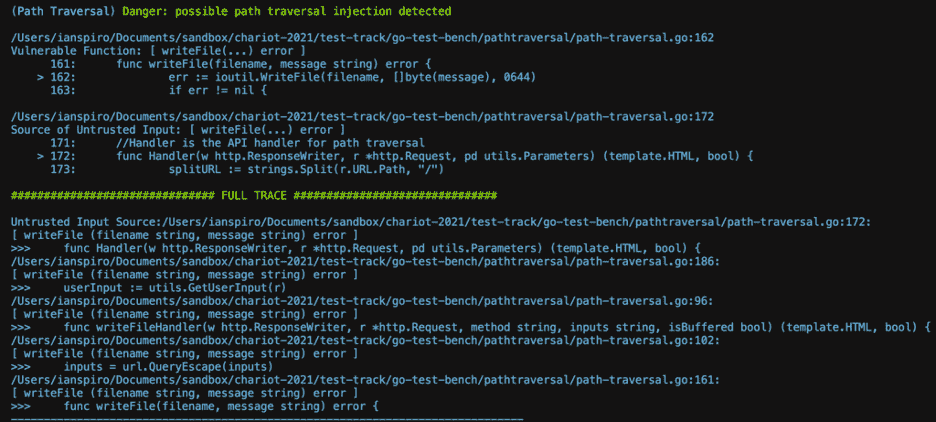
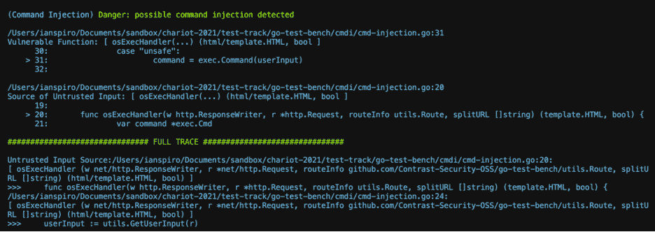
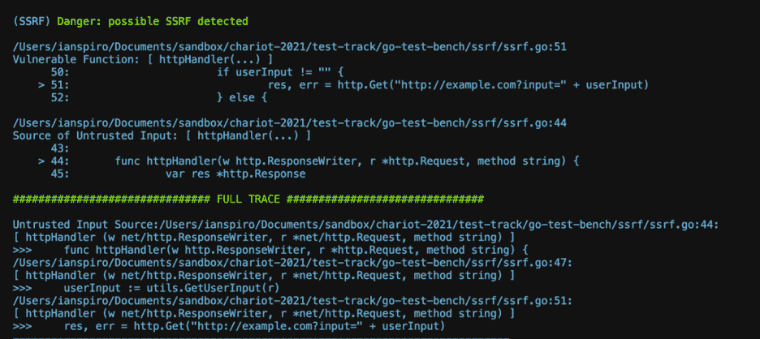
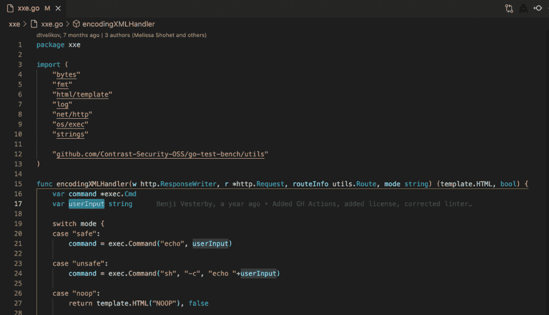
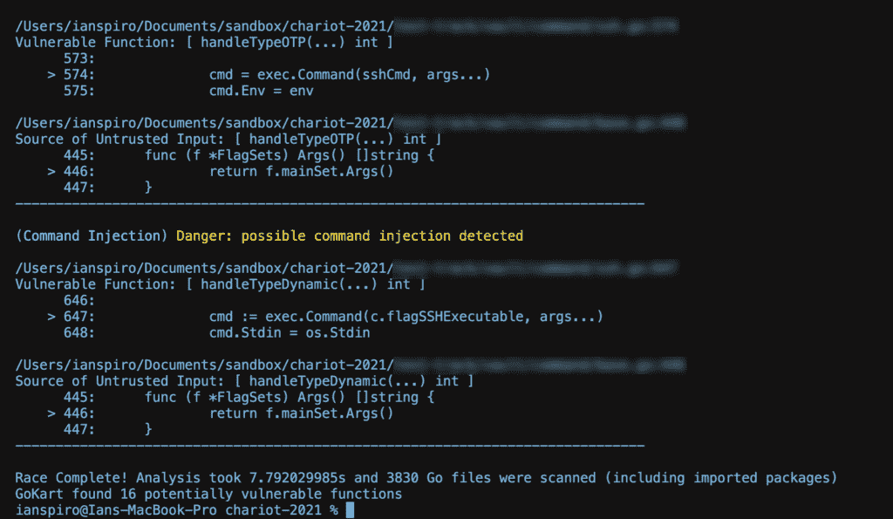
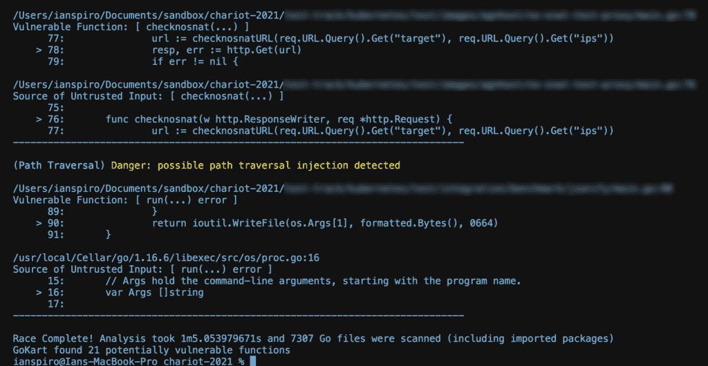
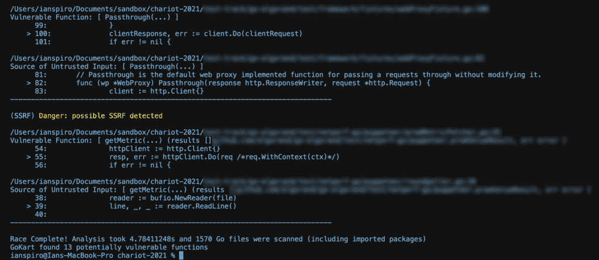

# Gokart:一个保护 Go 代码的静态分析工具

> 原文：<https://kalilinuxtutorials.com/gokart-a-static-analysis-tool-for-securing-go-code/>

**GoKart** 是一款针对 Go 的静态分析工具，使用 Go 源代码的 SSA (single static assignment)形式发现漏洞。它能够跟踪变量和函数参数的来源，以确定输入源是否安全，与其他 Go 安全扫描器相比，这减少了误报的数量。例如，一个与变量连接的 SQL 查询传统上可能被标记为 SQL 注入；但是，GoKart 可以计算出变量实际上是常数还是常数的等价物，在这种情况下就不存在漏洞。

**我们为什么要造卡丁车**

静态分析是一种在源代码中寻找漏洞的强大技术。然而，这种方法存在噪音——也就是说，许多静态分析工具发现了相当多实际上并不存在的“漏洞”。这导致了开发人员的摩擦，因为用户厌倦了工具“狼来了”。

GoKart 的动机是为了解决这个问题:我们能否创造一种比现有工具假阳性率低得多的扫描仪？根据我们的实验，答案是肯定的。通过利用源到汇跟踪和 SSA，GoKart 能够跟踪变量赋值之间的变量污点，从而显著提高发现的准确性。我们的重点是可用性:实际上，这意味着我们已经优化了我们的方法来减少错误警报。

欲了解更多信息，请阅读我们的博客文章。

**介绍 GoKart，一款更智能的 Go 安全扫描仪**

在 Praetorian，我们致力于推动和促进开源安全项目，并从根本上专注于开发技术，以增强网络安全的整体状态。我们喜欢我们的热情和商业承诺重叠的时候，所以今天我们很兴奋地宣布 GoKart 的首次发布——一款更智能的 Go 安全扫描仪。

GoKart 是我们新的开源安全策略的第一次尝试，我们的目标是用包含一组基线功能的工具播种社区，希望它能刺激进一步的发展。我们没有试图为特定的安全问题制定规则，而是专注于使用 Go analysis 包发布几个高级分析器，这些分析器提供了我们发现现有开源项目所缺少的功能。我们的目标是通过基于直接用户反馈的附加特性来参与和激发社区。我们的愿景是成为 GoKart 引擎的制造和维护组织，让其他人专注于微调和制造推车，同时驾驶更高性能的机器。

静态分析工具是现代开发管道的关键部分，在整个开发生命周期中以各种形式使用。在 ide 中，甚至在你点击编译按钮之前，语法检查器就会发现错误。在幕后，它们确定源代码是否具有有效的形式和结构，解析类型信息，并在编译期间执行优化。甚至代码自动完成方法也是基于简单的静态分析，帮助提示程序员下一步该做什么。所有这些工具都很棒……但是令人兴奋的是，至少对我们来说，当我们为了识别安全漏洞而将这些方法应用于源代码时。如果做得好，静态应用程序安全测试(SAST)有可能在提高安全性和生产率的同时降低成本。这是一个非常好的结果。

动态分析实际上是运行一个程序，要求代码完整并处于完全可构建的状态，相比之下，静态测试更适合在开发过程的早期执行，而且经常在开发过程中执行。由于静态分析只考虑源代码，因此不需要设置定制的测试环境，从而减轻了对生产 web 服务器、防火墙、微服务等的昂贵且复杂的复制和沙箱化的需求。就其本质而言，静态分析提供了对本地开发构建中包含的任何源文件的可见性和分析覆盖。尽管更高级的静态分析技术需要创建定制的规则和配置，而这些规则和配置的设置和有效使用都很复杂，但经常被忽略的事实是，静态应用安全测试(SAST)也可以非常快速、易于使用，并且对于交付高质量代码和实施一致的安全编码标准至关重要。

在安全环境中，SAST 有助于及早发现常见的不安全编程模式，并在整个开发生命周期中强制执行安全的编码标准。SAST 具有可伸缩和快速的优势，允许它集成到 CI/CD 管道中。Praetorian 提供了自己的 CI/CD 安全平台，[战车](https://praetorian.com/chariot)，可以将 SAST 应用于每一次提交。随着 GoKart 的发展，它将成为 Chariot 的可用扫描器之一，为开发人员添加额外的上下文，使他们不仅可以快速找到问题，还可以为他们提供有用的信息，帮助他们解决问题。更好的是，这项服务是免费提供的，是我们全面了解整个企业的基础设施和代码的安全状况的基础。

在过去的十年中，静态分析技术已经从其卑微的起源发展而来。早期的林挺服务可能只是将简单的正则表达式规则应用于代码，而更现代的方法利用数据流分析，通过应用程序的调用图表示从用户输入中跟踪用户可控制的数据，并将其传播到所有已知易受特定类型的利用的函数。在研究的前沿，在学术领域开发的静态分析技术已经转移到使用符号执行、模型检查、约束分析和形式方法来创建更强大的源代码建模和评估能力。同时，回到真实的安全世界，商业工具一直在努力真正利用这些更复杂和计算密集型的技术，通常选择增加语言广度而不是分析深度。更糟糕的是，对于依赖于搜索 Github 来寻找和定制我们的安全工具的开发世界的其他人来说，我们发现即使是 20 年前开创的数据流技术也还没有突破它们的公司牢笼。相反，大多数开源 SAST 工具已经恢复到类似 grep 的模式匹配策略，要么直接在源代码上，要么在程序的抽象语法树(AST)表示上。

**我们为什么要做 GoKart？**

在禁卫军，我们吃自己的狗粮。鉴于我们使用 Go 进行攻击性工具开发的历史，以及我们最近从基于 Java Spring 的微服务向更高效、灵活和安全的、完全容器化的、基于 Kubernetes 的架构的转变，使用 Go 来简化战车平台，我们强烈感受到改善自动化 Go 安全分析的当前状态。

在过去的十年中，商用 SAST 工具因使用过于复杂、噪音大、不准确以及购买和维护成本高而声名狼藉。他们的基于编译器的分析引擎对静态类型的语言如 C++、Java 和 C#工作得很好，但一直在努力使他们的技术适应动态类型的语言如 JavaScript 或 Python，并且在接受 Docker、Kubernetes 和 Go 的云原生范式方面进展缓慢。另一方面，开源安全扫描器已经被大量创建，但通常还不够成熟，不足以证明给定的发现确实是安全威胁，或者足够可靠和准确地工作，足以被信任以自动、独立的方式运行。

采用所有工具面临的最大挑战是高误报率，以及缺乏证据来准确显示*为什么*被标记的项目易受攻击。例如，许多安全扫描器只会报告某一行代码有安全问题，而不会显示攻击者可能采取的利用途径。其他工具具有更复杂的功能，但需要安全敏锐度和查询语言编程专业知识。在实践中，这些缺点导致了假阳性疲劳和需要与扫描仪搏斗直到警告消失的心态。GoKart 旨在通过提供用户友好、更准确和更少噪音的体验来解决这些问题，并帮助开发人员快速自信地发现和理解高影响问题的完整攻击路径。

在创建 GoKart 的过程中，我们受到了目前使用最广泛的 Go 安全扫描仪 gosec T1 的启发，对它的易用性印象深刻，但我们想看看是否可以改进它目前的结果。Gosec 包含 30 条规则，这些规则将模式匹配应用于 Go 代码的抽象语法树(AST)表示。使用该语言的 AST 有助于 gosec 准确了解每个表达式、常量和函数与其他语言结构的关系，并防止对代码结构的任何“误读”。在安全方面，gosec 处理各种问题，从 SQL 注入和解压缩炸弹到短密钥长度和过时的 TLS 设置。gosec 目前缺乏的主要分析能力是执行“污点跟踪”或确定用户可控数据可能到达易受攻击函数的代码路径的能力。添加污点跟踪将允许以某种方式编写规则，以大大减少与更简单的签名、文本或 AST 模式匹配相关联的假阳性结果。此外，如果问题没有被准确地控制在预期的位置，gosec 可能不会揭示潜在的攻击路径，从而给用户带来虚假的安全感，并引发安全专业人员的进一步不信任。例如，对手可能控制了一个字符串，该字符串后来被用来构造一个查询，从而在程序执行时比 SQL 查询执行时更早地导致 SQL 注入；类似地，用作创建 RSA 密钥的大小参数的常数值可以由一个函数初始化，由第二个函数修改，然后由第三个函数使用。在每种情况下，攻击路径或安全缺陷可能源自不同的函数，甚至不同的文件，如果没有污点跟踪或数据流分析，这些情况很可能不会被检测到。从 gosec 停止的地方开始，GoKart 首先识别源代码中潜在易受攻击的函数，然后追踪这些函数的输入，直到它们的源代码。如果输入源可能由用户控制(例如在 SQL 注入)，或者如果输入源被定义为“易受攻击的”(例如 RSA 密钥生成器中的短密钥长度)，GoKart 将输出该漏洞。

【GoKart 是如何工作的？

在设计 GoKart 时，我们的重点是提供 Go 中高影响力发现的可见性，这为我们的安全工程师在现场执行代码审查以及我们自己的开发人员构建新工具提供了重要价值。我们添加了一些功能来执行轻量级版本的污点传播和分析器，利用这些功能来处理我们在对 Go 中开发的应用程序执行手动代码审查时发现的几个最有趣和最普遍的漏洞:命令注入、路径遍历和服务器端请求伪造。通过增加用新的接收器定制 GoKart 的能力，以创建额外的漏洞类型以及针对特定企业威胁模型定制的用户输入源。根据我们有限的测试，我们相信我们已经在工具灵活性和可用性之间取得了正确的平衡，提供了令人愉快的开箱即用的体验，几乎不需要配置来处理高影响漏洞，信噪比明显更好。

GoKart 使用 Go 分析包来构建调用图，并将 Go 代码放入单个静态赋值(SSA)表单中，将程序计算的每个值构造为一个唯一变量的赋值。SSA 在编译器中用于优化，在安全上下文中，它可以帮助我们追溯用作输入的数据的来源。以 SSA 的形式进行分析比简单地使用 AST 有一些好处。GoKart 的 SSA 表单更适合查看数据流，因为所有的值赋值都是一次性完成的。能够在数据流经程序时跟踪数据，编织进出对象和模块，这是 GoKart 的主要特性之一，也是 GoKart 如此强大的原因。它可以跟踪所有包含的包和模块。以 SSA 形式遍历调用图也简化了代码结构，只需要我们处理 SSA 原语，而不是所有的 Go 类型。

SSA 还具有在分析过程中实现持续传播的优势。一些错误配置和设计漏洞只有在使用某个参数的情况下才适用，比如创建一个长度过短的 RSA 密钥，使得密钥可被破解。静态分析传统上不能计算非文字的表达式，但是通过常量传播，常量属性和参数可以在不运行代码的情况下计算。因此，如果您将变量而不是文字传递给“rsa.GenerateKey ”,安全扫描器无法确定是否真的有问题。现在，假设变量是一个常量，或者是一个在编译时可以计算的常量，GoKart 可以确定 RSA 密钥的长度。因此，GoKart 能够适应不同的编程风格，并且不局限于对如何编写代码的某些期望，例如期望函数的文字参数。

GoKart 包含一个可定制的输入源和易受攻击的接收器的列表，由于它进行污点跟踪，它可以准确地显示易受攻击的输入源在代码中的哪个位置被输入到应用程序中。污点跟踪不仅大大降低了静态分析的误报率，而且使用 GoKart 产生的数据路径使修复变得更加容易。

尽管在使用 SSA 进行常量和污点传播方面取得了一些进步，但我们基于 AST 的调用图实现有许多自己的局限性。没有适当的调用流图(CFG)构造，我们的污点分析将不会适当地考虑计算机程序将分支到的所有路径；例如，导致方法内的流不敏感，以及在单个调用路径中错误地找到来自两个分支的节点的情况。还需要执行一定程度的指针分析，以更准确地对 Go 通道的并发性建模——我们目前通过假设从通道返回的数据被污染而过度近似，从而导致潜在的误报。全局变量也带来了巨大的挑战，因为它们打破了 SSA 关于潜在状态变化的假设。

**结果**

对于四种实验性漏洞类型，GoKart 能够降低其他 Go 扫描器的假阴性和假阳性率。特别是，GoKart 比 gosec 更准确，因为它使用污点跟踪进行操作，对编程风格做出更少的假设，并且只在潜在的漏洞实际上来自被认为是用户可控制的或具有潜在恶意的输入源时发出警报。

从我们的实验测试平台转移到一个易受攻击的示例应用程序表明，我们对降噪和信号放大的直觉是正确的。通过扫描由 Contrast Security 开发的 go-test-bench 应用程序，GoKart 从我们最常见的三种漏洞类型(路径遍历、命令注入和服务器端请求伪造(SSRF ))中发现了 8 个真阳性，每个都有支持证据，其形式为从用户可控制的输入到易受攻击的功能的踪迹。

Trace 显示处理程序方法接收 httpRequest 类型的指针并将其分配给 userInput，最终用于调用易受攻击的函数 ioutil。WriteFile()

跟踪显示函数 osExecHandler 接收 http 类型的指针。请求，将其分配给 userInput，然后直接用于对易受攻击的方法 exec 的调用。命令()

跟踪显示函数 httpHandler 接收 http 类型的 painter。请求，将其分配给 userInput，然后使用它来创建一个 URL，该 URL 用于调用易受攻击的方法 http。获取()。

乍看之下，gosec 仅运行等效检查的总体结果非常相似(总共 7 个结果；不存在对 SSRF 的检查),但是对 gosec 发现的、但 GoKart 中没有的特定命令注入漏洞进行深入研究，证明了正确跟踪用户对易受攻击函数的输入的价值:

虽然仅基于调用站点将此标记为漏洞似乎是合理的，但是如果`**userInput**`变量来自外部可控源(例如 http。请求)。

然而，通过跟踪代码可以清楚地看到,`**userInput**`显然是一个直接在使用之前从函数内部创建的局部变量，没有恶意输入到达易受攻击的函数的可能性，因此这种分类是一个假阳性结果，需要一定水平的安全专业知识来识别，甚至在这样一个小的、故意易受攻击的应用程序中也存在。

离开测试跑道并在现实世界中驾驶 GoKart 让我们了解了它在大型企业代码库中的表现。我们已经开始扫描一些我们最喜欢的 Go 应用程序，并发现从可用性的角度来看，结果相当鼓舞人心。

在 grpc-go(https://github.com/grpc/grpc-go)上运行表明，GoKart 只显示了 2 个路径遍历结果，这两个结果看起来都很合理，只是它们是在基准测试中发现的，因此我们不会向客户报告。事实上，整个扫描结果可以显示在一个页面截图中，这给了我们一种温暖模糊的感觉，我们走在正确的道路上:

我们现在正在围绕 GitHub 来回比赛 GoKart，并发现结果以及整体驾驶体验值得与世界分享。我们计划更深入地研究一些真实世界的发现，并在不久的将来分享这些发现，但对于那些对预览感兴趣的人来说，这里是一些比赛结果(项目细节已经过编辑，以实践我们负责任的披露政策):

Trace on real world project 1 ran for 8 seconds, scanned 3,830 files, and identified 16 potential vulnerabilities

Trace on real world project 2 ran for 1 minute 5 seconds, scanned 7,307 files, and identified 21 potential vulnerabilities

Trace on real world project 3 ran for 4 seconds, scanned 1,570 files, and identified 13 potential vulnerabilities

## 安装

您可以使用下面列出的任何一个选项在本地安装 GoKart。

### 用`go install`安装

**$去安装 github.com/praetorian-inc/gokart@latest**

### 安装一个发布二进制文件

*   从[发布页面](https://github.com/praetorian-inc/gokart/releases)下载操作系统的二进制文件。
*   (可选)下载`checksums.txt`文件以验证归档文件的完整性

**#检查下载档案的校验和
$ shasum-a 256 go kart _ $ { VERSION }*$ { ARCH } . tar . gz b 05 C4 d 7895 be 260 aa 16336 f 29249 c 50 b 84897 dab 90 e 1221 c 9 e 96 af 9233751 f 22 go kart*$ { VERSION }*$ { ARCH } . tar . gz $ cat go kart*$ { VERSION .**

*   提取下载的档案

【t0 $ tar-xvf 棋盘格 _ $ {版本} $ { arch } . tar . gz】t1

*   将`gokart`二进制文件移动到您的路径中:

**$ mv。/gokart /usr/local/bin/**

**克隆并打造自己**

**#克隆 GoKart repo
$git 克隆 https://github.com/praetorian-inc/gokart.git
#导航到 repo 目录并构建
$ CD GoKart
$ go build
#将 go kart 二进制文件移动到您的路径中
$mv。/gokart /usr/local/bin**