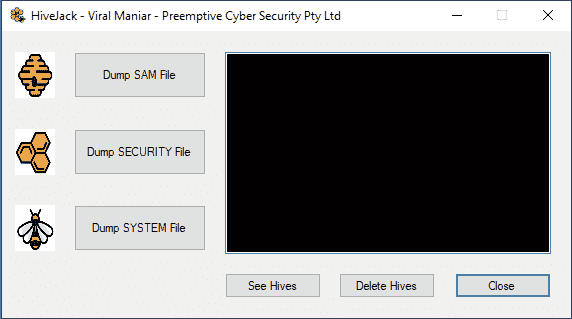
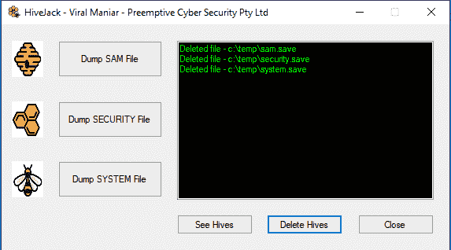

# HiveJack:内部渗透测试转储 Windows 凭据

> 原文：<https://kalilinuxtutorials.com/hivejack/>

**HiveJack** 是一种工具，可以在内部渗透测试期间使用，以从已经受损的主机中转储 Windows 凭据。它允许用户转储系统、安全和 SAM 注册表配置单元，一旦复制到攻击者的机器上，就可以选择删除这些文件来清除跟踪。

通常，这是一个重复的过程，一旦攻击者获得了对受损主机的系统级访问权限，下一步就是转储配置单元值。对于内部渗透测试来说，时间是非常宝贵的。在转储和删除文件时，HiveJack 将为您节省大量时间。你永远不需要记住执行动作的命令。

转储到受损主机的 *c:\temp\* 文件夹中的文件:

点击**删除配置单元**按钮，文件从被入侵的主机上成功删除:

欢迎对该工具提出任何建议或想法——只需在[@ mania viral](https://twitter.com/maniarviral)上给我发推特

配置单元是注册表中项、子项和值的逻辑组，当操作系统启动或用户登录时，它将一组支持文件加载到内存中。

**另请阅读-[三大开源软件安全问题以及如何缓解它们](https://kalilinuxtutorials.com/open-source-software-security/)**

注册表文件有以下两种格式:

*   标准格式:Windows 2000 支持，为了向后兼容，更高版本的 Windows 也支持
*   最新格式:从 Windows XP 开始支持

**HKEY _ 当前 _ 用户，HKEY _ 本地 _ 机器\萨姆，HKEY _ 本地 _ 机器\安全，和 HKEY _ 用户。违约；所有其他配置单元都使用最新的格式。**

在内部渗透测试中，攻击者通常希望从一台主机横向移动到另一台主机。要从一台主机转移到另一台主机，攻击者通常需要帐户凭据。使用 **HiveJack** 攻击者将能够通过系统配置单元收集凭证。

一旦攻击者成功获得其中一台受损主机的本地管理员或系统权限，HiveJack 就非常有用。为了进一步获得网络内部的访问权限，攻击者可以使用注册表配置单元。转储这些配置单元将允许攻击者捕获系统用户的密码哈希。

在转储注册表配置单元并将其放在攻击框上时，可以使用诸如 **secretsdump** 之类的工具，此处提供:[https://github . com/SecureAuthCorp/impacket/blob/master/examples/secretsdump . py](https://github.com/SecureAuthCorp/impacket/blob/master/examples/secretsdump.py)

一旦获得了密码散列，它就为各种攻击打开了大门，例如传递散列、喷洒或密码破解，以在网络内执行横向移动。

当 hive 文件被复制到攻击机器时，从 *temp* 文件夹中删除这些文件是一个好的做法，以避免泄露敏感文件或清除痕迹。

**快速提示**

检查 *C:\Windows\repair\* 位置以获取 SAM 和系统文件，以避免被 EDR 解决方案检测到，这是一个很好的做法。但是，该目录包含原始*C:\ Windows \ System32 \ config \*文件的过时副本，因此它可能不会反映当前用户的凭证。然而，如果密码被破解，知道任何密码模式可能是有用的，例如**冬季 2020** 或**夏季 2020**

我如何使用这个？

*   **方法一:**使用发布部分的 HiveJack.exe 文件([https://github . com/Viralmaniar/hive jack/releases/download/v 1.0/hive jack . exe](https://github.com/Viralmaniar/HiveJack/releases/download/v1.0/HiveJack.exe))并在被入侵的主机上运行。蜂巢将被存储在*的 c:\temp\* 文件夹中。
*   **方法 2:** 使用 **Visual Studio** 打开解决方案，查看构建解决方案的代码。

**注意:**在转储注册表配置单元之前，请确保您在受损主机的“C:”驱动器中有一个 *temp* 文件夹。

[**Download**](https://github.com/Viralmaniar/HiveJack)