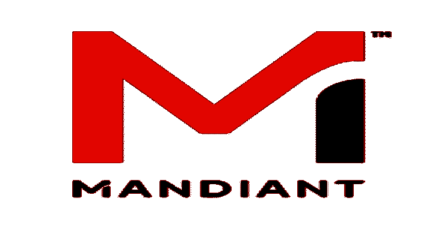

# Mandiant-Azure-AD-Investigator:用于检测工件的 PowerShell 模块

> 原文：<https://kalilinuxtutorials.com/mandiant-azure-ad-investigator/>

**man diant-Azure-AD-Investigator**存储库包含一个 PowerShell 模块，用于检测可能是 UNC2452 和其他威胁参与者活动指示器的工件。一些指示器是妥协的“高保真”指示器，而另一些工件是所谓的“两用”工件。两用工件可能与威胁参与者活动相关，但也可能与合法功能相关。这些都需要分析和验证。有关 UNC2452 使用的技术的详细描述，请参见我们的博客。

这个工具是只读的。它不会对 Microsoft 365 环境进行任何更改。

总之，本模块将:

*   尽最大努力确定需要进一步验证和分析的危害指标

它将*而不是*:

*   100%的时间识别折衷方案，或者
*   告诉您工件是合法的管理活动还是威胁参与者活动。

有了社区反馈，该工具在检测 IOC 时可能会变得更加彻底。如果您有问题、想法或反馈，请打开问题、提交 PR 或联系作者。

**特色**

**联合域(Invoke-MandiantAuditAzureADDomains)**

 **该模块使用 MS Online PowerShell 在 Azure AD 中查找和审计联合域。所有联合域都将输出到文件`**federated domains.csv**`。

*   **签名证书异常有效期**–在签名证书有效期为> 1 年的联合域上发出警报。AD FS 托管证书的有效期仅为一年。超过一年的有效期可能表示威胁参与者已经篡改了域联盟设置。它们也可能表示使用了合法的自定义令牌签名证书。让您的管理员验证是否是这种情况。
*   **签名证书不匹配**–针对签名证书的颁发者或主题不匹配的联合域的警报。在大多数情况下，令牌签名证书总是来自同一个颁发者，并且具有相同的主题。如果存在不匹配，则可能表示威胁参与者已经篡改了域联盟设置。让您的管理员验证主题和颁发者名称是否是预期的，如果不是，请考虑执行取证调查，以确定更改是如何进行的，并确定任何其他损害证据。
*   **Azure AD back door(any . STS)**–针对将`**any.sts**`配置为发行者 URI 的联合域的警报。这表明 Azure AD 后门工具的使用。考虑执行取证调查，以确定更改是如何进行的，并识别任何其他危害证据。
*   **联合域**–列出所有联合域和令牌颁发者 URI。请验证该域是否应该联合，以及颁发者 URI 是否是预期的。
*   **未验证的域**–列出 Azure AD 中所有未验证的域。未经验证的域不应在 Azure AD 中长时间处于未经验证的状态。请考虑删除它们。

**例子**

**！！发现 AAD 后门的证据。
考虑进行详细的取证调查【foobar.com】
域名
域名联盟:
联盟发行人:http://any.sts/16B45E3B URI**

该脚本已经识别出与发行者 URI 联合的域，该发行者是 Azure AD 后门的指示器。后门默认设置发行方 URI 为 hxxp://any.sts。考虑执行取证调查，以确定更改是如何进行的，并识别任何其他危害证据。

**！！令牌签名证书的有效期超过 365 天。
这可能是不是由 AD FS 生成的签名证书的证据。
域名:foobar.com
联盟发行人 uri:http://sts.foobar.com
签名证书在此之前无效:2020 年 1 月 1 日 00:00:00
签名证书在此之后无效:2025 年 12 月 31 日 23:59:59**

**服务委托人(Invoke-MandiantAuditAzureADServicePrincipals)**

此模块使用 Azure AD PowerShell 来查找和审核 Azure AD 中的服务主体。

*   **添加了凭证的第一方服务主体**–第一方(微软发布的)服务主体不应添加凭证，除非在极少数情况下。处于或以前处于混合模式的环境可能会向 Exchange Online、Skype for Business 和 AAD 密码保护代理服务主体添加凭据。验证服务主体凭据是合法用例的一部分。如果凭据不合法，请考虑执行取证调查。
*   **具有高级别特权和添加的凭证的服务主体**–识别具有分配的高风险 API 权限和添加的凭证的服务主体。虽然服务主体和添加的权限可能是合法的，但添加的凭据可能不是。验证服务主体凭据是合法用例的一部分。验证服务主体需要列出的权限。

**例子**

**使用添加的凭证识别第一方(微软发布的)服务主体。
只有在极少数情况下，第一方服务主体才应该有附加凭证。
验证添加的凭据具有合法的用例，如果不合法，则考虑进一步调查
对象 ID:xxxxxxxx-xxxx-xxxx-xxxx-xxxxxxxxxxxx
应用 ID:xxxxxxxx-xxxx-xxxx-xxxx-xxxxxxxxxxxx
显示名称:Office 365 Exchange Online
密钥凭据:
CustomKeyIdentifier :
结束日期:12/9/2017 2:10:29 AM
密钥 ID:xxxxxxxxxxx-XXXXXX**

该脚本已标识了添加了凭据的第一方(Microsoft)服务主体。第一方服务主体应该*而不是*添加凭证，除非在极少数情况下。处于或以前处于混合模式的环境可能会向 Exchange Online、Skype for Business 和 AAD 密码保护代理服务主体添加凭据。这也可能是您环境中 UNC2452 活动的产物。请咨询您的管理员并搜索审核日志，以验证凭据是否合法。您还可以使用 Azure AD 登录刀片中的“服务主体登录”选项卡来搜索对使用此服务主体的租户的身份验证。

**！！确定了具有高风险 API 权限的服务主体并添加了凭据。
验证添加的凭证是否具有合法的用例，如果不合法，则考虑进一步调查
对象 ID:xxxxxxxx-xxxx-xxxx-xxxx-xxxxxxxxxxxx
应用 ID:xxxxxxxx-xxxx-xxxx-xxxx-xxxxxxxxxxxx
显示名称:TestingApp
关键凭证:
CustomKeyIdentifier :
结束日期:1/7/2025 12:00:00AM
Key ID:xxxxxxxxxxx-xxxx-xxxx 读写。全部**

该脚本已标识了一个具有高风险 API 权限的服务主体并添加了凭据。这是意料之中的，因为一些第三方或定制的应用程序需要添加凭据才能运行。这也可能是您环境中 UNC2452 活动的产物。请咨询您的管理员并搜索审核日志，以验证凭据是否合法。您还可以使用 Azure AD 登录刀片中的“服务主体登录”选项卡来搜索对使用此服务主体的租户的身份验证。

**应用程序(Invoke-MandiantAuditAzureADApplications)**

该模块使用 Azure AD PowerShell 在 Azure AD 中查找和审计应用程序。

*   **具有高级别权限和附加凭证的应用程序**–对具有高风险 API 权限和附加凭证的应用程序发出警报。虽然应用程序和添加的权限可能是合法的，但添加的凭据可能不是。验证应用程序凭据是合法用例的一部分。验证应用程序需要列出的权限。

**例子**

**发现具有凭证的高特权应用程序。
验证应用程序需要这些权限。
验证添加到应用程序中的凭证是否与合法的用例相关联。
ObjectID:xxxxxxxx-xxxx-xxxx-xxxx-xxxx-xxxxxxxxxxxx
AppID:xxxxxxxx-xxxx-xxxx-xxxx-xxxxxxxxxxxx
display name:Acme Test App
key credentials:
password credentials:
custom key identifier:
end date:12/22/2021 4:01:52pm
key id:xxxxxxxxxxx-xxxx-xxxx-xxxx-xxxx-xxxx-xxxx-xxxxxxxxxxxxxxxxxxxxxx
读取(读取所有邮箱中的邮件)目录。Read.All(读取组织目录中的所有数据)**

该脚本已识别出具有高风险 API 权限的应用程序，并添加了凭据。这是意料之中的，因为一些第三方或定制的应用程序需要添加凭据才能运行。这也可能是您环境中 UNC2452 活动的产物。请咨询您的管理员并搜索审核日志，以验证凭据是否合法。

**云解决方案提供商计划(Invoke-MandiantGetCSPInformation)**

此模块检查租户是否由 CSP 或合作伙伴管理，以及是否启用了委托管理。委托管理允许 CSP 以与全局管理员相同的权限访问客户租户。尽管 CSP 计划对合作伙伴的租户实施了强有力的安全控制，但危及 CSP 的威胁参与者可能能够访问客户环境。组织应该验证他们的合作伙伴是否需要委派管理权限，如果不需要，则删除该权限。如果合作伙伴必须维护委派的管理员访问权限，请考虑实施条件访问策略来限制他们的访问权限。

组织可以通过导航到管理中心并导航到左侧菜单栏上的`Settings` - > `**Partner Relationships**`来检查和管理 **e 合作伙伴关系。**

**【邮箱文件夹权限(Get-mandiantmailboxfolderperpermissions)**

此模块审核租户中的所有邮箱是否存在可疑的文件夹权限。具体来说，该模块将检查每个邮箱中的“信息存储顶部”和“收件箱”文件夹，并检查分配给“默认”和“匿名”用户的权限。除“None”之外的任何值都将导致邮箱被标记为待分析。一般来说，默认用户和匿名用户不应该拥有用户收件箱的权限，因为这将允许任何用户阅读他们的内容。一些组织可能会找到具有此权限的共享邮箱，但不建议这样做。

**应用程序模拟(Get-MandiantApplicationImpersonationHolders)**

 **此模块输出拥有 ApplicationImpersonation 角色的用户和组的列表。该命令输出中的任何用户或组成员都可以使用模拟来“充当”并访问租户中任何其他用户的邮箱。组织应该审核此命令的输出，以确保只包括预期的用户和组，并在可能的情况下进一步限制范围。

**统一审计日志(Get-mandiantun 2452 auditlogs)**

 **此模块是用于搜索统一审核日志的帮助器脚本。搜索统一审核日志有许多容易被忽略的技术警告。本模块通过实施浏览这些警告和处理一些常见错误的最佳实践，有助于简化搜索过程。

默认情况下，该模块将搜索可以记录 UNC2452 技术的日志条目。日志记录也可能捕获合法的管理员活动，并且需要进行验证。

*   **更新应用程序**–记录更新应用程序注册所采取的措施。
*   **Set Domain Auth**–记录域的身份验证设置何时更改，包括创建联盟领域对象。这些事件在环境中很少发生，可能表示威胁参与者正在配置 AAD 后门。
*   **设置联盟设置**–记录域的联盟领域对象何时被修改。这些事件在环境中应该很少发生，可能表示威胁参与者准备执行 Golden SAML 攻击。
*   **更新应用证书和密码**–记录密码或证书何时添加到应用注册中。
*   **PowerShell 邮箱登录**–记录客户端应用程序为 PowerShell 的邮箱登录操作。
*   **更新服务主体**–记录对现有服务主体进行更新的时间。
*   **添加服务主体凭证**–记录何时将秘密或证书添加到服务主体。
*   **添加应用角色分配**–记录添加应用角色(应用权限)的时间。
*   **用户的应用程序角色分配**–记录应用程序角色分配给用户的时间。
*   **PowerShell 身份验证**–记录用户何时使用 PowerShell 客户端向 Azure AD 进行身份验证。
*   **新管理角色分配**–记录新管理角色分配的创建时间。这对于确定新的 ApplicationImpersonation 授权非常有用。

**用法**

**所需模块**

PowerShell 模块需要安装三个 Microsoft 365 PowerShell 模块。

*   AzureAD
*   mt 在线
*   ExchangeOnlineManagement

要安装模块:

*   以本地管理员身份打开 PowerShell 窗口(右键单击，然后选择以管理员身份运行)
*   运行命令`**Install-Module <MODULE NAME HERE>**`并按照提示进行操作

**所需用户权限**

PowerShell 模块必须使用分配了特定权限的 Microsoft 365 帐户运行。

*   Azure 广告门户中的`**Global Administrator**`或`**Global Reade**r`角色
*   `**View-Only Audit Logs**`在交换控制面板中

要在外汇控制面板中授予帐户`View-Only Audit Logs`:

*   导航到 https://outlook.office365.com/ecp，以全局管理员或 exchange 管理员的身份登录(如果您在备用云中，URL 可能会有所不同)
*   点击仪表板中的`**admin roles**`，或者如果你在新的 UI 中，展开左边的`**roles**`选项卡并点击`**admin roles**`
*   通过单击`**+**`符号或单击`**add new role group**`创建一个新的管理员角色
*   给你的角色一个名字和默认的写范围
*   向角色添加`**View-Only Audit Logs**`权限
*   将用户添加到角色中

**注意**申请这个职位可能需要一个小时

**运行工具**

*   下载这个工具的 ZIP 文件并解压缩，或者将这个库克隆到您的系统中
*   打开 PowerShell 窗口
*   将目录更改到该模块的位置`**cd C:\path\to\the\module**`
*   导入这个模块`**Import-Module .\MandiantAzureADInvestigator.psd1**`你应该会收到这个输出

**man diant Azure AD Investigator
专注于 UNC2452 调查
PS C:\ Users \ admin \ Desktop \ man diant>**

通过运行`**Connect-MandiantAzureEnvironment -UserPrincipalName <your username here>**`连接到 Azure AD。您应该会收到一个登录提示，并输出到 PowerShell 窗口，指示连接已经建立。**注意**:如果您遇到问题，您可能需要通过运行`**Set-ExecutionPolicy -ExecutionPolicy RemoteSigned**`来改变您的执行策略。这可能需要管理员权限。

除了 9 个更快、更可靠的新 cmdlet 之外，该模块还允许访问所有现有的远程 PowerShell(V1)cmdlet。
|————————————————————————————|
|旧 cmdlet |新/可靠/更快的 cmdlet |
|————————————————————————————————|
| Get-cas Mailbox | Get-EXOCASMailbox |
| Get-Mailbox | Get-EXOCASMailbox |
| Get-Mailbox folderpermission | Get-exocasfoldbox 有关该模块的问题，请联系 Microsoft 支持部门。不要对问题或支持问题使用反馈别名。
账号环境 TenantId tenant domain
doug@test.onmicrosoft.com azure cloud xxxxxxxx-xxxx-xxxx-xxxx-xxxxxxxxxxxx test . onm…

*   运行所有检查`**Invoke-MandiantAllChecks -OutputPath <path\to\output\files>**`。您还可以使用特定的 cmdlet 运行单独的检查。
*   查看屏幕上的输出和编写的 CSV 文件。

[**Download**](https://github.com/mandiant/Mandiant-Azure-AD-Investigato)******