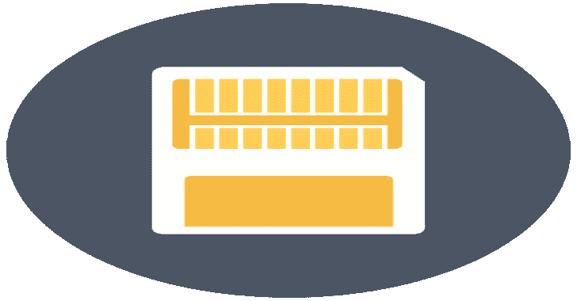

# 内存映射器:将本机和托管程序集都映射到内存中

> 原文：<https://kalilinuxtutorials.com/memory-mapper/>

**内存映射器**是一个轻量级库，允许通过使用用户指定的进程的进程注入或自注入，将本机和托管程序集映射到内存中；将程序集注入到当前正在运行的试图进行注入的进程中的技术。

该库不仅附带了映射程序集的工具，还附带了加密、解密和生成各种强加密数据的功能。

**要求**

**注意:**(仅针对使用内存映射器**的运行中的程序集** —不针对存根/外壳代码)

*   Windows 7 SP1 版及更高版本
*   。NET 框架 4.6.1

**特性**

*   探索 PE(可移植可执行文件)的结构
*   从托管和本机程序集中读取资源
*   使用进程注入和自注入将本机程序集映射到内存中
*   使用进程注入和其他技术将托管程序集映射到内存中
*   获取任何文件大小的任何文件的字节数组
*   加密和解密整个文件和原始字节
*   生成并验证文件和原始字节的校验和
*   使用`**SecureRandom**`对象生成加密的强随机数据
*   附带多种加密和哈希算法

*   **加密**
    *   AES *(ECB)*
    *   AES *(CBC)*
    *   AES[t0(CFB)
    *   AES *(OFB)*
    *   AES *(CTR)*
*   散列法
    *   讯息摘要 5
    *   RIPEMD160
    *   SHA1
    *   SHA256
    *   SHA384
    *   SHA512

**又读——[法拉第:协同渗透测试&漏洞管理平台](https://kalilinuxtutorials.com/faraday/)**

**例题**

*   **原生注射**

这个例子展示了如何使用`**NativeLoader**`工具将一个本地程序集静态映射到内存中。该示例通过从磁盘读取文件的所有字节来加载文件，然后将与字节相关联的 *PE(可移植可执行文件)*直接注入内存。使用本地加载器结合我的 [Amaterasu](https://github.com/CloneMerge/Amaterasu) 库中的*动态代码编译*，我们可以从内存中的代码完成动态代码编译和注入。

使用系统；
使用系统。木卫一；
使用系统。反思；
使用 MemoryMapper
命名空间示例
{
类程序
{
静态 void Main(string[]。args)
{
//获取我们要加载的文件的字节。
var file path = " FileToReadBytesOf "；
var fileBytes = File。read all bytes(file path)；
//检查程序集是托管的还是本机的。
bool is managed = false；
试试
{
//注意——这是检查程序集最简单的变化之一
var assembly name = assembly name。GetAssemblyName(file path)；
if(程序集名称！= null)
if (assemblyName。全名！= null)
is managed = true；
}
catch { is managed = false；}
//如果程序集确实是本机的，请尝试加载它。
如果(！is managed)
{
native loader loader = new native loader()；
如果(loader。LoadAssembly(fileBytes))
控制台。WriteLine("程序集加载成功！");
其他
控制台。WriteLine("未能加载程序集。");
}
//等待用户交互。
控制台。read()；
}
}

**管理注射**

此示例演示如何通过读入托管程序集的字节(或使用嵌入的字节数组)，然后使用 ManagedLoader 注入当前正在运行的进程，将托管程序集静态映射到内存中。几乎任何托管程序集都可以使用提供的 ManagedLoader 工具进行映射。

使用系统；
使用系统。木卫一；
使用系统。反思；
使用 MemoryMapper
命名空间示例
{
类程序
{
静态 void Main(string[]args)
{
//获取我们要加载的文件的字节。
var file path = " FileToReadBytesOf "；
var fileBytes = File。read all bytes(file path)；
//检查程序集是托管的还是本机的。
bool is managed = false；
试试
{
//注意——这是检查程序集最简单的变化之一
var assembly name = assembly name。GetAssemblyName(file path)；
if(程序集名称！= null)
if (assemblyName。全名！= null)
is managed = true；
}
catch { is managed = false；}
//如果程序集确实是托管的，请尝试加载它。
if (isManaged)
{
//设置一个代理流程的名称——我们将要注入的流程。
var process name = " explorer . exe "；//也可以是自注入的当前进程的名称。
managed loader loader = new managed loader()；
如果(loader。LoadAssembly(fileBytes，processName))
控制台。WriteLine("程序集加载成功！");
否则
控制台。WriteLine("未能加载程序集。");
}
//等待用户交互。
控制台。read()；
}
}
}

**免责声明**

本软件按“原样”提供，不含任何明示或暗示的担保，包括但不限于对适销性、特定用途适用性和不侵权的担保。在任何情况下，作者或版权所有者都不对任何索赔、损害或其他责任负责，无论是在合同诉讼、侵权诉讼或其他诉讼中，还是在与软件或软件的使用或其他交易相关的诉讼中。

[**Download**](https://github.com/jasondrawdy/MemoryMapper)