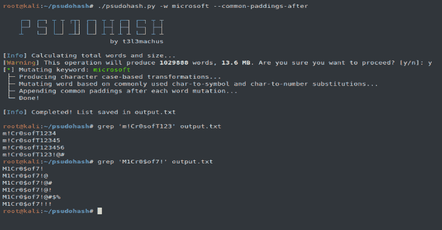

# Psudohash:密码列表生成器，关注由常用密码创建模式变异的关键字

> 原文：<https://kalilinuxtutorials.com/psudohash/>

.png)

psudohash 是一个密码列表生成器，用于策划暴力攻击。它模仿人类常用的某些密码创建模式，如用符号或数字替换单词的字母，使用大小写变化，在单词前后添加常用填充等等。它是基于关键字和高度可定制的。

### 测试企业环境

系统管理员和其他员工经常使用公司名称的变体来设置密码(例如 Am@z0n_2022)。网络设备(Wi-Fi 接入点、交换机、路由器等)、应用程序甚至域帐户都是如此。通过最基本的选项，psudohash 可以基于常见的字符替换模式(可定制)、大小写变化、常用作填充的字符串等，生成一个或多个关键字的所有可能变化的单词列表。看一下下面的例子:

该脚本包括一个基本的字符替换模式。您可以通过编辑源代码并遵循以下数据结构逻辑来添加/修改字符替换模式(默认):

**变换= [
{'a' : '@'}，
{'b' : '8'}，
{'e' : '3'}，
{'g' : ['9 '，' 6']}，
{'i' : ['1 '，'！']}，
{'o' : '0'}，
{'s' : ['$ '，' 5']}，
{'t' : '7'}
]**

### 个人

说到人，我想我们都(或多或少)设置了密码，使用一个或多个对我们有意义的词的变体，例如，我们的名字或妻子/孩子/宠物/乐队的名字，在最后加上我们出生的年份，或者可能是一个超级安全的填充，如“！@#".你猜怎么着？

## 装置

无特殊要求。只需克隆回购并使脚本可执行:

**git 克隆 https://github . com/T3 L3 macus/PSU dohash
CD。/PSU hash
chmod+x PSU hash . py**

## 使用

**。/psudohsh . py[-h]-w WORDS[-an LEVEL][-nl LIMIT][-y YEARS][-AP VALUES][-CPB][-CPA][-CPO][-o FILENAME][-q]**

帮助对话框[ -h，–help]包括用法细节和示例。

## 使用技巧

*   将选项 **`--years`** 和`**--append-numbering**`与任意年份输入的`**--numbering-limit**` ≥最后两位数字组合，将最有可能产生重复单词，因为该工具实现了突变模式。
*   如果您在源代码中添加自定义填充值和/或修改预定义的公共填充值，并结合多个可选参数，出现重复单词的可能性很小。psudohash 包括单词过滤控件，但是为了速度的缘故，这些是有限的。

[Download](https://github.com/t3l3machus/psudohash)