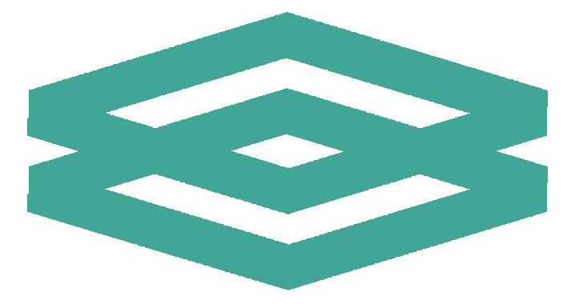

# Purify:管理漏洞报告的一体化工具

> 原文：<https://kalilinuxtutorials.com/purify/>

**的目标是将**净化成一个易于使用且高效的工具，以简化管理来自各种工具的漏洞的工作流程。

Purify 被设计来分析**任何工具**的报告，如果报告是 JSON 或者 XML 格式的话。这意味着您不需要任何特殊的插件来处理您选择的工具的报告。

Purify 能够在各种漏洞扫描器或工具中移除重复的结果。此外，它可以基于某些字段组合同一工具的多个结果，并且是完全可配置的(不需要编码)。Purify 做了所有这些工作来减少分析师的头痛。

在一个地方收集所有安全发现，审查/验证/跟踪它们，协作，获得通知(Slack)，将它们导出到跟踪系统(吉拉)等等。

**用**建造

*   [Nest](https://github.com/nestjs/nest)–使用的 web 框架
*   [Vue 化](https://github.com/vuetifyjs/vuetify)–Vue 的材料组件框架

**特性**

目前，Purify 支持 [Slack](/purify/plugins/slack) 和[吉拉](/purify/plugins/jira)。另外，还有 [SMTP](/purify/plugins/email) 模块，但目前没有使用。

用于这些模块的包列表:

*   [jira 连接器](https://www.npmjs.com/package/jira-connector)
*   [节点邮件程序](https://www.npmjs.com/package/nodemailer)
*   [@slack/webhook](https://www.npmjs.com/package/@slack/webhook)

**部署****Nginx 和 MongoDB**

*   **概述**
    *   此部署基于两个 docker 映像:
        *   [https://hub . docker . com/r/faloker/purify API](https://hub.docker.com/r/faloker/purify-api)
        *   [https://hub . docker . com/r/faloker/purify-engine](https://hub.docker.com/r/faloker/purify-nginx)
            *   提供静态文件(vue 前端)
            *   提供 https
            *   通过 http2 提供文件
    *   [https://hub . docker . com/_/mongo](https://hub.docker.com/_/mongo)(如果你想要本地 mongob)
*   **本地设置**:要在本地启动 Purify 而不需要证书和其他生产工具，您可以做以下事情:
    *   克隆存储库
    *   运行`**docker-compose -f docker-compose.tests.yml up --build**`

**也读作-[guarded box:安全存储的在线客户端管理器&秘密共享](https://kalilinuxtutorials.com/guardedbox/)**

**配置**

*   Docker-Compose :在部署之前，你可能需要在 Docker-Compose 文件中配置一些东西

// ./docker-compose.yml
//如果想要本地 MongoDB

**Mongo:
* * * * * * * ***
环境:
Mongo _ INITDB _ ROOT _ USERNAME:ROOT
Mongo _ INITDB _ ROOT _ PASSWORD:example
//更新本地路径到。env 文件(见 API/. env . example)

**API:
* * * ****
env _ file:
-. env . custom
//更新证书和密钥文件的本地路径

**Nginx:
* * * * * * * * ***
volumes:
–/path/to/cert:/etc/Nginx/SSL/cert
–/path/to/key://nginx . prod . conf:/etc/nginx/nginx . conf

**Nginx**

您可以编辑 nginx 配置文件，根据需要进行调整。有一个默认使用的配置[示例](https://github.com/faloker/purify/blob/master/nginx/nginx.prod.conf)，但是为了使用它，您需要更改[服务器名称](https://github.com/faloker/purify/blob/master/nginx/nginx.prod.conf#L25)选项。

**开始**

**坞站-合成 up -d**

**建有**

*   [Nest](https://github.com/nestjs/nest)–使用的 web 框架
*   [Vue 化](https://github.com/vuetifyjs/vuetify)–Vue 的材料组件框架

[**Download**](https://github.com/faloker/purify)