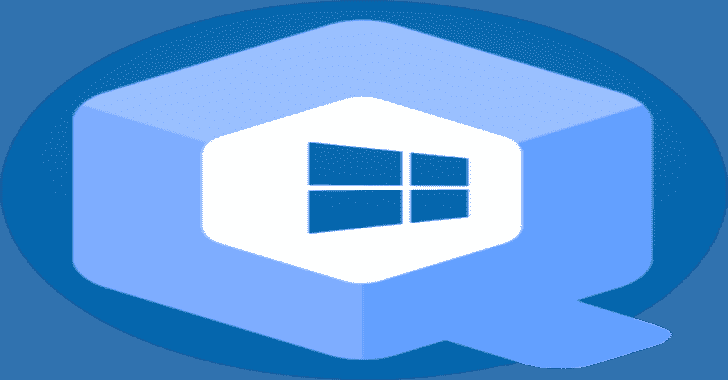

# Qvm-Create-Windows-Qube:快速、轻松、安全地运行新的 Windows Qubes

> 原文：<https://kalilinuxtutorials.com/qvm-create-windows-qube/>

**Qvm-Create-Windows-Qube** 是一款用 [Qubes Windows Tools (QWT)](https://www.qubes-os.org/doc/windows-tools/) 驱动自动快速方便安装全新 Windows [qubes](https://www.qubes-os.org/) 的工具。它正式支持 Windows 7，8.1 和 10 以及 Windows Server 2008 R2，2012 R2，2016 和 2019。

该项目强调正确性、安全性，并在整个过程中将 Windows 视为不可信的客户操作系统。它还具有其他功能，例如使用 [Chocolatey](https://chocolatey.org/) 自动安装包括 Firefox、Office 365、Notepad++和 Visual Studio 等软件包。

**安装**

*   通过打开链接，右键单击并选择“将[页面]另存为…”来下载[安装脚本](https://raw.githubusercontent.com/elliotkillick/qvm-create-windows-qube/master/install.sh)
*   通过在 Dom0 中运行以下命令，将`**install.sh**`复制到 Dom0 中:

`**qvm-run -p --filter-escape-chars --no-color-output <qube_script_is_located_on> "cat '/home/user/Downloads/install.sh'" > install.sh**`

*   检查`**install.sh**`的代码以确保其完整性
*   启用以上转义字符过滤更安全；当输出是文件时，qvm-run 默认禁用它

运行`**chmod +x install.sh && ./install.sh**`

*   注意，这将在全局默认 **`TemplateVM`，**中安装软件包，默认为`**fedora-XX**`
*   查看产生的代码`**qvm-create-windows-qube.sh**`
*   Qubes R4.1 将提供更加简化和安全的打包安装流程。

**用途**

**用法:。/qvm-create-windows-qube . sh[options]-I-a
-h，–help
-c，–计算具有所需给定基本名称的 Windows qubes 的数量
-t，–template 使此 qube 成为模板 vm 而不是独立的 VM
-n，–NetVM NetVM for Windows 使用
-s，–无缝启用无缝模式在重新启动后持续运行
-o，–优化通过禁用 qube 的不必要功能来优化 Windows
-y，–spyless 配置 Windows 遥测 –软件包以逗号分隔的要预安装的软件包列表(请参见 https://chocolatey.org/packages 的可用软件包)
-i，–iso Windows media 自动安装和设置
-a，–Windows 安装的答案文件设置**

**下载 Windows ISO**

`**windows-media/isos/download-windows.sh**`脚本(在`**windows-mgmt**`中)安全地下载官方的 Windows ISO 供 **`qvm-create-windows-qube`使用。**

**创建 Windows 虚拟机**

**Windows 10**

`**./qvm-create-windows-qube.sh -n sys-firewall -oyp firefox,notepadplusplus,office365proplus -i win10x64.iso -a win10x64-pro.xml work-win10**`

**Windows Server 2019**

`**./qvm-create-windows-qube.sh -n sys-firewall -oy -i win2019-eval.iso -a win2019-datacenter-eval.xml fs-win2019**`

**Windows 10 LTSC**

*   微软官方提供的更稳定、更精简、更安全、更私密的 Windows 10 版本

`**./qvm-create-windows-qube.sh -n sys-firewall -oyp firefox,notepadplusplus,office365proplus -i win10x64-ltsc-eval.iso -a win10x64-ltsc-eval.xml work-win10**`

**Windows 7**

*   不推荐，因为微软不再支持 Windows 7，但是，如果需要无缝窗口集成或动态调整大小，这是 Qubes GUI 驱动程序(在 Qubes Windows 工具中)支持的唯一桌面操作系统
*   有关详细信息，请参阅下面的安全>窗口>咨询部分

`**./qvm-create-windows-qube.sh -n sys-firewall -soyp firefox,notepadplusplus,office365proplus -i win7x64-ultimate.iso -a win7x64-ultimate.xml work-win7**`

**安全**

qvm-create-windows-qube 是“相当安全的”,因为 [Qubes](https://www.qubes-os.org/) 会拥有它。

*   有气隙吗
*   整个 Windows qube 设置过程是在空气间隙中完成的
    *   在 Windows qube 安装的最后安装软件包有一个例外
*   通过不让 Dom0 shell 脚本解析来自不受信任的`**windows-mgmt**` qube 的任何输出，消除了整个类的命令注入漏洞
    *   只有退出代码被`**qvm-run**`通过；没有变量
    *   这也减轻了另一个 shell shock Bash 漏洞的影响
*   Windows ISOs 的下载通过实施以下措施而变得安全:
    *   iso 是直接从微软控制的`**microsoft.com**`子域名下载的
    *   HTTPS TLS 1.2/1.3
    *   HTTP 公钥锁定(HPKP)将网站的证书列入白名单，而不是依赖证书颁发机构(CAs)
        *   Qubes 旨在[“不信任基础设施”](https://www.qubes-os.org/faq/#what-does-it-mean-to-distrust-the-infrastructure)
        *   记住，`**transport security = encryption * authentication**`(这允许最大限度的认证)
    *   下载后对文件的 SHA-256 验证
*   Windows 一直被视为不受信任的客户操作系统
*   维护人员的所有提交总是用他们各自的 PGP 密钥签名
    *   如果签署停止，假设妥协
    *   当前维护者 1: [埃利奥特·基里克](https://github.com/elliotkillick)
        *   PGP 密钥:018 f B9 de 6 DFA 13FB 18FB 5552 F9 B9 0d 44 F83D d5f 2
    *   当前维护者 2: [弗雷德里克·皮耶雷](https://github.com/fepitre)(无密钥库账户)
        *   PGP 密钥:9fa 6 4b 92 F95E 706 b F28E 2c a6 4840 10 b5 CD C5 76e 2
        *   最关心的是 Qubes R4.1 支持
            *   参见 **`release4.1`** 分支和[qubes-mgmt-salt-windows-mgmt](https://github.com/fepitre/qubes-mgmt-salt-windows-mgmt)
*   Windows ISO 处理中的任何理论漏洞(例如文件系统解析中的漏洞)或应答文件的影响仅限于`**windows-mgmt**`

**窗户**

维护

不要忘记在创建您的 Windows qube 时应用任何适用的更新。微软经常为当前版本的 Windows(如 Windows 10)建立最新的 iso。对于这些 Windows 版本，建议定期访问微软官方网站`**download-windows.sh**`以获得全新的 Windows 映像。

**咨询**

Windows 7 和 Windows Server 2008 R2 于 2020 年 1 月 14 日到达生命周期终点(EOL)。如果付费，这些操作系统的更新仍然可以通过扩展安全更新(ESUs)获得。这些操作系统的 Office 365 将继续免费获得安全更新，直到【2023 年 1 月。

如果要在 Windows 7 qube 上启用 RDP(非默认)，那么请确保它是完全最新的，因为不幸的是，微软提供的最新 Windows 7 ISO 仍然容易受到 [BlueKeep](https://en.wikipedia.org/wiki/BlueKeep) 和相关 DejaBlue 漏洞的攻击。

Windows 10 和 Windows Server 2016/2019 密码术中的一个关键漏洞[最近被披露](https://media.defense.gov/2020/Jan/14/2002234275/-1/-1/0/CSA-WINDOWS-10-CRYPT-LIB-20190114.PDF)。这允许在这些操作系统(包括 HTTPS；浏览器中的小挂锁)很容易被拦截。当微软发布更新的 ISO 时， **`download-windows.sh`** 中的直接链接将被更新，但在此之前，如果他们运行上述操作系统，请更新您的量子。

**隐私**

qvm-create-windows-qube 旨在成为最私密的 windows 使用方式。许多 Qubes 用户放弃 Windows(或另一种专有操作系统)，部分原因是为了远离微软(或一般意义上的大型科技公司)，因此能够在安全距离内使用 Windows 对该项目至关重要。或者至少，对于一个巨大的、专有的二进制 blob 来说，是尽可能安全的距离。

**视窗遥测**

配置 Windows 遥测设置以尊重隐私。

*   退出客户体验改善计划(CEIP)
*   禁用 Windows 错误报告(WER)
*   禁用 DiagTrack 服务
*   关闭 Windows 10“设置”应用程序中的所有遥测功能
*   在兼容版本的 Windows 10 上启用遥测的“安全”级别
*   更多信息见 **`spyless.bat`**

**针对 Windows-Whonix-Workstation 的 Whonix 建议**

这里提到的[到](https://www.whonix.org/wiki/Other_Operating_Systems)的一切都实现了“更高的安全性”。“最安全”是使用一个官方的 Whonix-Workstation，该工作站是您自己从源代码中构建的。这项功能不是官方的，也没有得到 Whonix 的认可。

建议阅读[本](https://www.whonix.org/wiki/Windows_Hosts) Whonix 文档，以理解以这种方式使用 Windows 的含义。

**轻松重置指纹**

每个 Windows 安装中都有无数的唯一标识符，例如 MachineGUID、安装 ID、NTFS 驱动器卷序列号(vsn)等等。使用 qvm-create-windows-qube，可以通过自动重新安装 windows 来轻松重置这些唯一标识符。

**限制**

在虚拟机遭到破坏的情况下，可以通过虚拟机管理程序进行指纹识别，以下是一些实际示例(不特定于 Windows):

*   [Xen 时钟源作为挂钟](https://phabricator.whonix.org/T389)
    *   时区泄漏至少可以通过在 BIOS/UEFI 中配置 UTC 时间来缓解，本地时区仍然可以配置为 XFCE Dom0 时钟
    *   但是，其他虚拟机之间的相关性仍然微不足道
*   [CPUID](https://github.com/QubesOS/qubes-issues/issues/1142)
*   一般来说，一些虚拟机界面在这里记录了(例如屏幕尺寸)

**投稿**

你可以从给这个项目一颗星开始！也欢迎高质量的 PRs！如果你在寻找需要改进的地方，看看下面的待办事项列表。其他改进，如更优雅的完成任务的方式，代码清理和其他修复也是受欢迎的。

感兴趣的人可以看很多与 Windows 相关的 GSoCs。

这个项目的标志是由马克斯安德森，书面许可使用。

这个项目是一项独立工作的成果，没有得到 Qubes OS 的官方认可。

**Qubes Windows 工具已知问题**

如果可以的话，请发送这些补丁。虽然，要知道 Qubes Windows Tools[目前还没有维护](https://github.com/elliotkillick/qvm-create-windows-qube/issues/15)。

**我们所有人**

*   [未安装 Qubes GUI 驱动程序时，无窗口显示](https://github.com/QubesOS/qubes-issues/issues/5739)
    *   除 Windows 7/Windows Server 2008 R2 以外的任何操作系统都不支持 Qubes GUI 驱动程序
    *   临时修复:运行 **`qvm-features <windows_qube> gui`** `1`以在 Windows qube 创建完成后显示

**除 Windows 7/Windows Server 2008 R2 版之外的所有操作系统**

*   [提示安装早期版本的。网络](https://github.com/QubesOS/qubes-issues/issues/5091)
    *   这看起来只是一个表面问题，因为 qrexec 服务仍然工作
    *   已经被合并，但是 QWT 需要被重建以包含它，并且目前没有维护者

**Windows 10/Windows Server 2019**

*   [私有磁盘创建失败](https://github.com/QubesOS/qubes-issues/issues/5090)
    *   临时修复:关闭`prepare-volume.exe`窗口导致没有私有磁盘(不能创建`TemplateVM`)，但除此之外，Windows qube 创建将照常继续
    *   已经被合并，但是 QWT 需要被重建以包含它，并且目前没有维护者

**邮件列表线索**

*   [量子用户](https://groups.google.com/forum/#!topic/qubes-users/AdQcjg7XOFo)
*   [qubes-devel](https://groups.google.com/forum/#!topic/qubes-devel/aCCGpYysZTQ)

**Windows 标记的 Qubes OS GitHub 问题**

*   [T2`C: windows-tools`](https://github.com/QubesOS/qubes-issues/labels/C%3A%20windows-tools)
*   [T2`C: windows-vm`](https://github.com/QubesOS/qubes-issues/labels/C%3A%20windows-vm)

**待办事项**

*   获得对任何给定 ISO 9660 (Windows ISO 格式)可靠地解包/插入应答文件/重新打包的能力
    *   ISO 9660 是一次性写入(即只读)文件系统；你不能在没有创建一个全新的 ISO 的情况下就把一个文件添加到它里面
    *   支持其他版本 Windows 的阻塞问题
    *   从下面视频中的“创建磁盘…”部分可以看出，这与 VMWare 的做法相同(进一步研究表明，他们使用了 **`mkisofs` )**
    *   在未来，Qubes 最好通过扩展 libvirt XML 模板的核心管理来做到这一点
        *   快多了
        *   由于不必创建新的 ISO，节省了存储空间
*   auto-qwt 取 D:\使 qwt 把用户配置文件放在 E:\；把它放在 D:\上会更好，这样中间就没有尴尬的空白了
*   让 Windows 应答文件自动使用 Windows 安装的默认试用密钥，而不在任何地方硬编码任何产品密钥(Windows 在这一点上很挑剔)
*   支持 Windows 8.1-10(注意:除了 Windows 7 之外，QWT 还没有正式发布任何操作系统，但是，除了 GUI 驱动程序之外，一切都正常)
*   支持 Windows Server 2008 R2 到 Windows Server 2019
*   支持 Windows 10 企业版(长期支持渠道)
    *   提供 10 年的安全更新，非常稳定，比库存 Windows 10 更少膨胀
*   提供巧克力
*   在这里添加一个选项来精简窗口
*   制造`**windows-mgmt**`气隙
*   我最近发现这是一个 Qubes [谷歌代码之夏](https://www.qubes-os.org/gsoc/)项目
    *   添加自动化测试
        *   使用 travis ci 进行自动拼写检查
    *   用于获取 Windows 许可证的 ACPI 表嵌入在那里
        *   找到更多这方面的信息，只要把下面的 jinja libvirt 模板扩展放在 **`/etc/qubes/templates/libvirt/xen/by-name/<windows_qube>`** 中就很简单了
            *   感谢@jevank 的[补丁](https://github.com/QubesOS/qubes-issues/issues/5279#issuecomment-525947408)
    *   Python 的端口
        *   对于像`**create-media.sh**`这样的脚本来说，这似乎是不必要的，因为 Python 脚本本质上只是调用外部程序
        *   不过这肯定适合于`**qvm-create-windows-qube.sh**`
            *   这将允许我们在 Dom0 和 VM 之间交换数据，而不用担心另一个 Shellshock
*   根据从`**wiminfo**`命令收集的 Windows ISO 特征自动选择使用哪个应答文件(当前为 WIP 见分支)
    *   就像 Windows 上的 DISM 一样
    *   一旦 core admin 扩展到允许 libvirt XML 模板(答案文件)成为可能(之前的 todo)，我们也可以安全地从 ISO 读取答案文件，甚至不必使用 [`libguestfs`](https://libguestfs.org/) 将其作为循环设备挂载
        *   我还见过在 QEMU/KVM 上使用的`**libguestfs**`,所以它绝对是这个用例的一个很好的候选
        *   注意`**libguestfs**`不能将(答案文件)写入 ISO，这就是为什么我们不能使用这个库，直到我们不再需要创建一个全新的 ISO 来添加答案文件
*   按照[本](https://www.whonix.org/wiki/Other_Operating_Systems) Whonix 文档制作 Windows-Whonix-Workstation
*   为`**create-media.sh**`添加功能，以添加要在 Windows 安装程序的 Windows PE 阶段(“安装更新…”阶段)安装的 MSU(Microsoft Update 独立软件包)
    *   我们可以使用 [KB4474419](https://github.com/QubesOS/qubes-issues/issues/3585#issuecomment-521280301) 来添加 SHA-256 支持，从而修复旧的 Windows 7 SP1 和 Windows Server 2008 R2 ISOs 当前无法工作的 QWT 安装
    *   允许我们通过修复 SHA-256 自动驱动程序安装错误来摆脱`**allow-drivers.vbs**` hack
        *   另一种选择是让 Xen 和 SHA-1 一起签署他们的驱动程序，其他驱动程序供应商似乎也这么做了，但是从安全的角度来看并不理想
    *   修补几个 Windows 安全漏洞？
        *   现成的 Windows 7 补丁 BlueKeep
        *   Windows Server 2008 R2 基础 ISO 也容易受到永久蓝色和开箱即用蓝色的攻击
        *   可能不值得深入讨论，用户应该在创建虚拟机时更新它
*   无头模式
    *   招聘广告
        *   在量子比特中有什么机制来完成这个？Qubes GUI 代理/守护进程中的一些东西？
*   打包该项目，以便通过`**qubes-dom0-update**`使其交付更加简化和安全
    *   来到 Qubes R4.1
*   考虑添加 ReactOS 支持，作为 Windows 的开源替代方案
    *   至少在 [ReactOS 模板制作完成之前，这是一个好消息](https://github.com/QubesOS/qubes-issues/issues/2809)
    *   ReactOS 开发人员可能想用它来开发 ReactOS
    *   或者可能只是添加 ReactOS 作为模板(在这个项目之外)
        *   然而，必须有人来维护这个模板
        *   此外，如果 QWT/Xen PV 驱动程序不工作，也没有多大意义
            *   至少对于像复制/粘贴和文件传输这样的基本功能
    *   双方的兴趣
        *   [量子操作系统](https://github.com/QubesOS/qubes-issues/issues/2809)
        *   试剂
            *   “迄今为止，我们收到的最有趣的合作提议之一”
    *   ReactOS 无人值守安装看起来与 Windows 不同
    *   我能找到的唯一阻塞问题是 QEMU SCSI 控制器类型
        *   Qubes 可以扩展 core admin 来支持在 libvirt 模板中配置 SCSI 控制器
            *   这个解决方案看起来更好，因为根据[这个](https://github.com/QubesOS/qubes-issues/issues/3651#issuecomment-420914348)评论，它也将修复一堆其他操作系统的安装程序不支持我们当前的 SCSI 控制器
        *   ReactOS 可以增加对我们当前 SCSI 控制器类型的支持
        *   [ReactOS 问题](https://reactos.org/forum/viewtopic.php?t=17529)
        *   [Qubes 操作系统发布](https://github.com/QubesOS/qubes-issues/issues/3494)
        *   暴露不同的 SCSI 控制器不会扩大攻击面，因为 QEMU 在 Xen 存根域中运行
    *   React 操作系统还处于测试阶段，所以对于大多数用户来说，现在可能还不可行
    *   招聘广告
        *   目前没有时间表

[**Download**](https://github.com/elliotkillick/qvm-create-windows-qube)