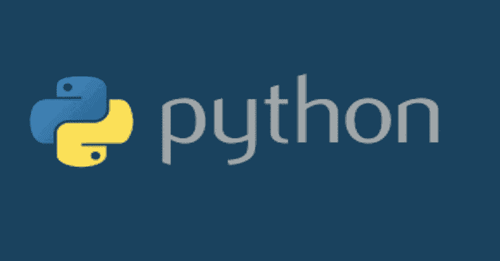

# Regipy:一个独立于操作系统的 Python 库，用于解析离线注册表配置单元

> 原文：<https://kalilinuxtutorials.com/regipy-python-library-registry-hives/>

Regipy 是一个 python 库，用于解析离线注册表配置单元。regipy 有很多功能:

*   用作库:
    *   从根目录或给定路径递归访问注册表配置单元，并获取所有子项和值
    *   读取特定的子项和值
    *   在注册表配置单元上应用事务日志
*   命令行工具
    *   将整个注册表配置单元转储到 json
    *   在注册表配置单元上应用事务日志
    *   比较注册表配置单元
    *   从一个健壮的插件系统执行插件(例如:amcache、shimcache、提取计算机名…)

**也可以理解为-[Youzer:用于活动目录环境的假用户生成器](https://kalilinuxtutorials.com/youzer-fake-user-active-directory/)**

**安装**

仅支持 python 3.7:

**pip 安装注册表**

此外，还可以通过克隆存储库并执行以下命令从源代码进行安装:

**python setup.py 安装**

**CLI**

**解析报头:**

**Registry-parse-header ~/Documents/test evidence/Registry/SYSTEM**

**将整个配置单元转储到磁盘(这可能需要一些时间)**

**Registry-dump ~/Documents/test evidence/Registry/NTUSER-CCLEANER。DAT -o /tmp/output.json**

通过添加`-t`标志，registry-dump util 还可以输出一个时间轴，而不是 JSON

**在蜂巢**上运行相关插件

**注册表-运行-插件~/Documents/test evidence/Registry/SYSTEM-o/tmp/plugins _ output . JSON**

将自动检测配置单元类型，并执行相关插件。 [**详见插件部分**](https://github.com/mkorman90/regipy/blob/master/docs/PLUGINS.md)

**比较注册表配置单元**

比较相同类型的注册表配置单元并输出到 CSV(如果未指定`-o`,输出将打印到屏幕上)

**registry-diff NTUSER . dat NTUSER _ modified . dat-o/tmp/diff . CSV**

**使用事务日志恢复注册表配置单元:**

**注册表-事务-日志 NTUSER。DAT-p ntuser . DAT . log1-s ntuser . DAT . log2-o recovered _ ntuser . DAT**

恢复后，将配置单元与 registry-diff 进行比较，看看发生了什么变化

**用作图书馆**

**初始化注册表配置单元对象**

**从 regipy.registry 导入 Registry hive
reg = Registry hive('/Users/martinkorman/Documents/test evidence/Registry/Vibranium-NTUSER。**

**递归遍历整个配置单元，从根关键字**开始

**对于 reg.recurse_subkeys 中的条目(as _ JSON = True):
print(entry)**

**迭代一个键，得到所有子键及其修改时间:**

对于 reg.get_key('软件')中的 sk。ITER _ subkeys():
print(sk . name，convert _ wintime(sk . header . last _ modified)。isoformat())

Adobe 2019-02-03t 22:05:32.525965
AppDataLow 2019-02-03t 22:05:32.526047
迈克菲 2019-02-03T22:05:32.526140
微软 2019-02-03T22:05:32.526282

**获取一个键的值:**

reg . get _ key(' Software \ Microsoft \ Internet Explorer \ browser emulation ')。get _ values(as _ JSON = True)
[{ ' name ':' cvlisttl '，
'value': 0，
'value_type': 'REG_DWORD '，
'is_corrupted': False}，
{'name': 'UnattendLoaded '，
'value': 0，
'value_type': 'REG_DWORD '，
'is_corrupted': False}，
{'name': 'TLDUpdates '，【T9]'
'value_type': 'REG_DWORD '，
'is_corrupted': False}，
{ ' name ':' IECompatVersionLow '，
'value': 2097211，
'value_type': 'REG_DWORD '，
'is_corrupted': False}，
{'name': 'StaleCompatCache '，【T33]' value ':0，
' value _ type ':' REG _ dw

**用作插件:**

从 regypy . plugins . ntuser . ntuser _ persistence 导入 NTUserPersistencePlugin
NTUserPersistencePlugin(reg，as_json=True)。Run()
{
' Software \ Microsoft \ Windows \ current version \ Run ':{
' timestamp ':' 2019-02-03t 22:10:52.655462 '，
' values ':[{
' name ':' Sidebar '，【T6]' value ':' % program files % \ Windows Sidebar \ Sidebar . exe/autoRun '，
'value_type': 'REG_EXPAND_SZ '，
'is_corrupted ':已损坏

**运行特定配置单元的所有相关插件**

从 regipy.plugins.utils 导入 run _ relevant _ plugins
reg = Registry hive('/Users/martinkorman/Documents/test evidence/Registry/SYSTEM ')
run _ relevant _ plugins(reg，as _ JSON = True)
{
' routes ':{，
' computer _ name ':[{
' Control _ set ':' Control set 001 \ Control \ computer name \ computer name '，【T6 _ name ':' DESKTOP-5eg 84 ug '，【T7]'中

[**Download**](https://github.com/mkorman90/regipy)