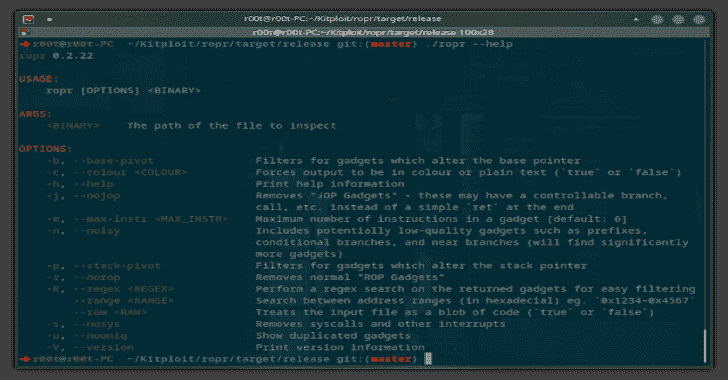

# Ropr:一个超快的多线程 ROP 小工具查找器。Ropper / Ropgadget 替代

> 原文：<https://kalilinuxtutorials.com/ropr/>

.png)

**ROP** (面向返回的编程)小工具是一些汇编指令的小片段，通常以`**ret**`指令结尾，这些指令已经作为可执行代码存在于每个二进制文件或库中。这些小工具可能被用于二进制攻击和破坏易受攻击的可执行文件。

当许多 ROP 小工具的地址被写入缓冲区时，我们就形成了一个 ROP 链。如果攻击者能够将堆栈指针移动到这个 ROP 链中，那么控制权就可以完全转移给攻击者。

大多数可执行文件包含足够的小工具来编写一个图灵完整的 ROP 链。对于那些不知道的，只要我们知道它们的地址，就可以使用包含在同一个地址空间中的动态库，比如 libc。

使用 ROP 小工具的好处在于不需要在任何地方编写新的可执行代码——攻击者只需使用程序中已经存在的代码就可以实现他们的目标。

### 如何使用 ROP 小工具？

通常，使用 ROP 小工具的第一个要求是有一个地方来写你的 ROP 链——这可以是任何可读的缓冲区。只需将您想要使用的每个小工具的地址写入该缓冲区。如果缓冲区太小，则可能没有足够的空间来写入长的 ROP 链，因此攻击者应该小心地将他们的 ROP 链制作得足够有效，以适合可用的空间。

下一个要求是能够控制堆栈——这可以采取堆栈溢出的形式——这允许 ROP 链直接写在堆栈指针下，或者“堆栈枢纽”——这通常是将堆栈指针移动到 ROP 链的其余部分的单个小工具。

一旦堆栈指针位于 ROP 链的起点，下一个`**ret**`指令将触发小工具按顺序执行——每个小工具都使用 next 作为自己堆栈帧上的返回地址。

也可以将函数参数添加到 ROP 链中——注意函数参数要在 ROP 链的下一个元素之后提供。这通常与“pop gadget”结合使用，pop gadget 将参数弹出堆栈，以便平滑地过渡到函数参数之后的下一个 gadget。

### 如何安装 ropr？

*   需要货物(铁锈生成系统)

易于安装:

**货物安装 ropr**

应用程序将安装到`**~/.cargo/bin**`

来自源

**git 克隆 https://github.com/Ben-Lichtman/ropr
CD ropr
货物构建–发布**

生成的二进制文件将位于`**target/release/ropr**`

或者:

git 克隆 https://github.com/Ben-Lichtman/ropr
CD ropr
货物安装路径。

应用程序将安装到`**~/.cargo/bin**`

### 如何使用 ropr？

**用法:
ropr【选项】
ARGS:
要检查的文件的路径
选项:
-b，–改变基指针的小工具的基轴过滤器
-c，–colour 强制输出为彩色或纯文本(`true`或`false` )
-h，–help 打印帮助信息
-j，–no jop 删除“jop 小工具”——这些可能有一个可控制的分支，
调用等。不是简单的`ret`结尾
-m，–max-instr 小工具中的最大指令数[默认值:6]
-n，–noise 包括潜在的低质量小工具，如前缀、
条件分支和近分支(将会发现大量
更多小工具)
-p，–stack-pivot 过滤器，用于修改堆栈指针的小工具
-r，–norop 删除正常的“rop 小工具”
-R， –regex 对返回的小工具执行 regex 搜索以方便过滤
–地址范围之间的范围搜索(十六进制)例如`0x1234-0x4567`
–raw 将输入文件视为代码块(`true`或`false` )
-s，–nosys 删除系统调用和其他中断
-V，–版本打印版本信息**

例如，如果我在寻找用另一个寄存器的值填充`**rax**`的方法，我可能会选择通过正则表达式`**^mov eax,** **...;**`进行过滤:

ropr/usr/lib/libc . so . 6-r " ^mov eax，…；"> /dev/null
在 0.118 秒内找到 197 个小工具

现在，我可以在命令行中添加一些过滤器，以获得最高质量的结果:

**ROP/usr/lib/libc . so . 6-m2-j-s-r“∞eax，……”
0x 000335 E7:mov eax，eax；后悔；
0x000788c8: mov eax、ecx 后悔；
0x00052252: mov eax，edi 后悔；
0x0003ae43: mov eax，edx 后悔；
0x 000335 E6:mov eax，r8d；后悔；
0x000788c7: mov eax，r2d；后悔；
在 0.046 秒内发现 6 个小工具**

现在我在地址`**0x00052252**`有了一个好的`**mov**`小工具候选

[**Download**](https://github.com/Ben-Lichtman/ropr)