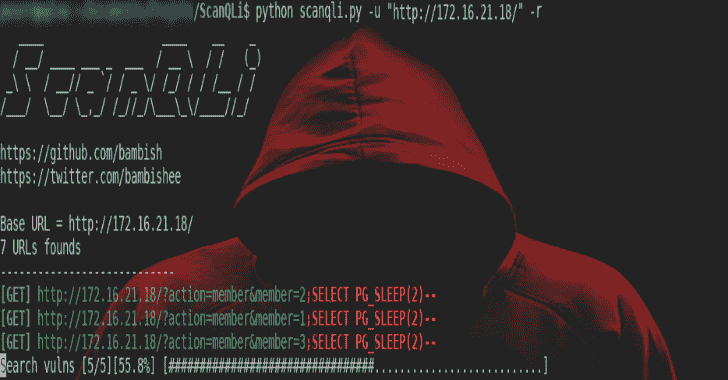

# scanli 检测 sql 漏洞

> 原文：<https://kalilinuxtutorials.com/scanqli/>

ScanQLi 是一款简单的 SQL 注入扫描仪，具有一些附加功能。这个工具不能利用 SQLi，它只是检测它们。在 Debian 9 上测试。
ScanQLi 是一个检测 SQL 漏洞的 SQLi 扫描器。

**特性**

*   经典的
*   盲目的
*   基于时间
*   GBK(很快)
*   递归扫描(跟踪被扫描网站的所有 hrefs)
*   Cookies 集成
*   请求之间的可调等待延迟
*   忽略给定的 URL

**先决条件**

**安装 git 工具**

**apt 更新
apt 安装 git**

**克隆回购。**

**git 克隆 https://github.com/bambish/ScanQLi**

**安装 python 所需的库**

**apt 安装 python-pip
CD scan qli**T3**pip install-r requirements . txt**

对于 python3，请安装 **python3-pip** 并使用 **pip3**

**也读作: [ParamPamPam:蛮发现参数的工具](https://kalilinuxtutorials.com/parampampam/)**

**用途**

。/scan qli-u[URL][选项]

**例题**

**带有输出文件的简单 URL 扫描**

python scan qli . py-u ' http://127 . 0 . 0 . 1/test/？p =新闻'-o 输出. log

**使用 cookies 进行递归 URL 扫描**

**python scan qli . py-u ' https://127 . 0 . 0 . 1/test/'-r-c ' { " PHPSESSID ":" 4 bn 7 uro 8 QQ 62 ol 4 o 667 bejbqo 3 "" Session ":" mzo 6 ywmzgrmowu 2 nwq 1 N2 ytu 2y Ji 0 ntmzodzjzdvkyju = " } '**

[Download](https://github.com/bambish/ScanQLi)