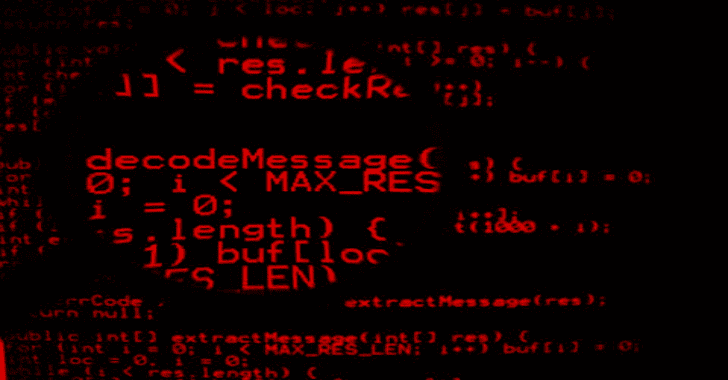

# Sojobo:一个二元分析框架

> 原文：<https://kalilinuxtutorials.com/sojobo-binary-analysis-framework/>

Sojobo 是一个 [B2R2](https://b2r2.org/) 框架的模拟器。创建它是为了简化对潜在恶意文件的分析。它完全是在。NET，所以你不需要安装或编译任何其他外部库(该项目是自包含的)。

使用 **Sojobo** ,您可以:

*   模拟(32 位)PE 二进制文件
*   检查模拟进程的内存
*   读取进程状态
*   显示已执行代码的反汇编
*   在托管语言中模拟函数(C# || F#)

这个概念是你为每个仿真的进程(只有一个线程)创建一个沙箱。所以通常第一步是创建一个 Win32Sandbox 对象:

**var sandbox = new win32 sandbox()；**

该对象将模拟流程执行。您可以使用它来获取关于正在运行的进程及其环境的信息。在此之前，您必须在沙箱中加载一个二进制文件。这可以通过使用可用的`Load`方法之一来完成，如下例所示:

**沙盒。load(" malware . exe ")；**

您可以通过执行`Run`方法开始执行:

**沙盒。run()；**

**又念——[目击者:设计截图网站](http://kalilinuxtutorials.com/eyewitness-designed-take-screenshots-websites/)**

**添加引用库**

默认情况下， *Sojobo* 包括模拟最常用的 Windows 函数的预编译库。 *Sojobo* 分析了导入表，并根据导入的库设置要调用的仿真函数。

您可以使用`**Win32SandboxSettings**`对象来控制这种行为，您可以将它作为参数传递给沙盒构造函数。

如果`**InitializeEnvironment**`为真(这是默认值)，那么 *Sojobo* 会尝试加载所有默认库，以便模拟这些函数。如果它设置为 false，您必须提供自己的库。

添加一个库非常简单，可以用`**AddLibrary**`方法完成。您可以指定原始二进制文件或程序集。为了截取一个函数，你必须遵循一个特定的名称空间模式。

例如，要模拟 Kernel32 中的函数 GetLastError，您必须创建名为 Kernel32、函数名为 GetLastError 的，如下例所示:

公共静态类 Kernel32
{
公共静态回调结果 GetLastError(ISandbox 沙箱)
{
var function return value = BitVectorFactory。创建(0x 57)；
返回新的 callback result(functionReturnValue。ToOption()，调用约定。CDE cl)；
}
}

第一个参数必须是类型`**ISandbox**`。您可以指定其他参数，这些参数的值将从堆栈中读取。参数的类型必须是`**Int32**` **或** `**UInt32**`。

每个仿真函数必须返回一个`**CallbackResult**`结果对象。它指定了可能返回的值和调用约定(该信息非常重要，因为它允许沙箱知道它是否必须根据函数接受的参数数量来清理堆栈)。

如果您决定添加一个简单的库(像一个本地库)，它将被映射到进程地址空间中，并且相应地更新`**PEB->Ldr**`值。

Sojobo 假设库是通过调用来调用的，所以在调用您的仿真函数之前，它会创建一个新的堆栈框架。当从仿真函数返回时，它还会破坏堆栈帧。

这种钩子只能通过检查 IAT 来放置，所以不能用这种方法在函数上设置任意的钩子。要做到这一点，你必须使用内存挂钩，解释如下。

**记忆挂钩**

一旦仿真到达一个给定的地址，内存钩子允许调用你的代码。您可以使用方法`**AddHook**`放置一个挂钩，如下例所示:

**沙盒。AddHook("kernel32！VirtualFree”、hook callback)；**

其中`**HookCallback**`函数的签名为:

**public static void hook callback(ISandbox 沙盒)
{
// …
}**

您可以指定一个符号名(如上例所示)或一个数字地址。

**过程容器**

每个仿真流程由一个`**IProcessContainer**`表示。您可以通过调用*沙箱*对象上的方法`**GetRunningProcess**`来获得对该对象的引用。

进程容器对象允许你访问寄存器和内存地址空间。您还可以设置一个事件处理程序来逐步执行它，如下例所示:

**var 流程=沙盒。GetRunningProcess()；
流程。step+= process step；**

其中`**ProcessStep**`函数具有以下签名:

**私有静态 void ProcessStep(对象发送方，IProcessContainer 进程)
{
// …
}**

接口导出了一些有用的方法来访问各种信息。下面是该界面的摘录:

///获取与进程关联的内存管理器
抽象内存:Memory manager with Get

///获取与进程关联的 CPU 对象
抽象 Cpu: Cpu with get

///返回被仿真进程的 Pid 值
抽象 Pid: UInt32 with get

///返回实际程序计数器值
抽象 program counter:emulated value with Get

// 获取进程当前正在执行的内存区域 abstract GetActiveMemoryRegion:unit->MemoryRegion

///获取二进制文件导入的符号列表
abstract getimported functions:unit->Symbol seq

///获取将要执行的下一条指令
abstract GetInstruction:unit->Instruction

///返回与当前调用栈相关的地址数组> 数组是通过遍历堆栈组成的，如果它损坏了，这个
///值也会损坏太抽象 GetCallStack:unit->uint 64 array
///获取当前进程的指针的位大小
抽象 GetPointerSize: unit - > Int32

**内存管理器**

可以通过内存管理器访问进程内存。你可以用它来读写进程内存。

创建内存管理器是为了方便从内存中读取结构。因此，如果您想从内存中读取 PEB 结构(一个相当复杂的结构)，您不需要读取缓冲区并解析它，您只需定义该类(它已经在 Sojobo 中定义了，所以不需要这样做)并读取它，如下例所示:

var peb = proc。Memory.ReadMemory <peb32>**(地址)；**</peb32><peb32>**var dllname = peb。ldr . inloadordermodulelist . fulldlname；**</peb32>

**CPU**

您可以通过使用`**Cpu**`对象读取特定的注册表值或设置其值。特别是通过使用这两个函数`**GetRegister**`和`**SetRegister**`。

**C#绑定**

B2R2，Sojobo 以及他们所有的工具都是用 F#写的。这可能会给 C#开发人员带来一些麻烦，所以我创建了一个新项目`**ES.Sojobo.CSharp**`来简化一些任务。

如果你计划用 C#编写自己的工具，确保引用这个库，并使用它的扩展方法或工厂方法来创建在 C#中不太友好的对象(像 F# *选项*类型)。

**编译**

为了编译 Sojobo 你需要。NET 核心和 Visual Studio。要编译，只需运行 **build.bat** 。

[**Download**](https://github.com/enkomio/Sojobo)