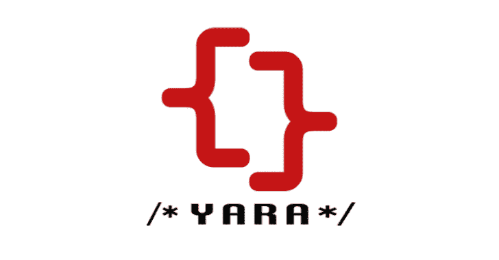

# Spyre:简单的 Based IOC 扫描仪

> 原文：<https://kalilinuxtutorials.com/spyre/>

**Spyre** 是一个简单的基于主机的 IOC 扫描器，围绕 [YARA](https://github.com/VirusTotal/yara) 模式匹配引擎和其他扫描模块构建。这个项目的主要目标是简化 YARA 规则和其他折衷指标的操作。

用户需要自带规则集。awesome-yara 库很好地概述了自由 yara 规则。

它旨在被事故响应者用作调查工具。它**而不是**旨在发展成任何类型的终端保护服务。

*   **使用 *Spyre* 很简单:**

1.  添加 YARA 签名。默认情况下，文件扫描的 YARA 规则分别从`filescan.yar`、`procscan.yar`读取，用于文件扫描、进程内存扫描。向*间谍*提供规则文件有以下几种选择(将按此顺序尝试):ZIP 文件内容可以使用密码`infected` (AV 行业标准)加密，以防止杀毒软件将规则集的部分内容误认为恶意内容而阻止扫描。YARA 规则文件可能包含`include`语句。
    1.  将规则文件添加到 ZIP 文件中，并将该文件附加到二进制文件中。
    2.  将规则文件添加到一个 ZIP 文件名`$PROGRAM.zip`:如果 Spyre 二进制文件被称为`spyre`或`spyre.exe`，使用`spyre.zip`。
    3.  将规则文件放入与二进制文件相同的目录中。ZIP file contents may be encrypted using the password
2.  部署，运行扫描仪
3.  收集报告

**配置**

运行时选项既可以通过命令行参数传递，也可以通过文件传递。空行和以`#`字符开始的行被忽略。每一行都被解释为一个命令行参数。

如果一个 ZIP 文件被附加到了 *Spyre* 二进制文件中，那么配置和其他文件，比如 YARA 规则，只能从这个 ZIP 文件中读取。否则，将从二进制文件所在的目录中读取它们。

一些选项允许指定项目列表。这可以通过使用分号(`;`)分隔项目来完成。

`**--high-priority**`

通常情况下(除非启用此开关)， *Spyre* 指示操作系统调度程序降低 CPU 时间和 I/O 操作的优先级，以避免中断正常的系统操作。

`**--set-hostname=NAME**`

明确设置将在日志文件和报告中使用的主机名。这通常不需要。

`**--loglevel=LEVEL**`

设置日志级别。有效:跟踪、调试、信息、通知、警告、错误、安静。

`**--report=SPEC**`

设置一个或多个报告目标，用分号(`;`)分隔。默认:`**spyre.log**`在当前工作目录下，使用普通格式。

附加`,**format=FORMAT**`可以指定不同的输出格式。目前支持以下格式:

*   **、`plain`、**默认的、简单易读的文本格式
*   `**tsjson**`，可以导入到 [Timesketch](https://github.com/google/timesketch) 的 JSON 文档

`**--path=PATHLIST**`

设置一个或多个要扫描的特定文件系统路径。默认:`/` (Unix)或所有固定驱动器(Windows)。

`**--yara-file-rules=FILELIST**`

设置用于扫描系统文件的 YARA 规则文件列表。默认:使用附加 ZIP 文件中的`filescan.yar`、`$PROGRAM.ZIP`或当前工作目录。

`**--yara-proc-rules=FILELIST**`

设置扫描进程内存区域的 YARA 规则文件列表。默认:使用附加 ZIP 文件中的`procscan.yar`、`$PROGRAM.ZIP`或当前工作目录。

`**--max-file-size=SIZE**`

设置要使用 YARA 扫描的文件的最大大小。默认值:32MB

`**--ioc-file=FILE**`

**关于 YARA 规则的说明**

YARA 配置有默认设置，以及以下显式开关(参见`3rdparty.mk`):

*   **T2`--disable-magic`**
*   **T2`--disable-cuckoo`**
*   **T2`--enable-dotnet`**
*   **T2`--enable-macho`**
*   **T2`--enable-dex`**

**大楼**

Spyre 可以在安装了以下软件包的 Debian/buster 系统(或 chroot)上为 32 位和 64 位 Linux 和 Windows 目标构建:

*   制造
*   （同 groundcontrolcenter）地面控制中心
*   gcc-多库
*   gcc-mingw-w64
*   autoconf
*   自动制造
*   libtool
*   pkg-配置
*   wget
*   修补
*   一项 Linux 指令
*   golang-*$版本* -go，例如 golang-1.8-go。Makefile 将自动选择最新版本，除非已经设置了`GOROOT`。
*   转到核心
*   ca 证书
*   活力

这描述了通过 CI 定期运行的构建环境。

同样的构建也在 Fedora 30 上成功地进行了尝试，安装了以下软件包:

*   制造
*   （同 groundcontrolcenter）地面控制中心
*   明瓦{32，64 }-海湾合作委员会
*   mingw{32，64}-winpthreads-static
*   autoconf
*   自动制造
*   libtool
*   pkgconf-pkg-config
*   wget
*   修补
*   一项 Linux 指令
*   golang
*   转到核心
*   ca 证书
*   活力

一旦所有东西都安装好了，只需输入`make`。这个要下载 *musl-libc* 、 *openssl* 、 *yara* 的档案，构建那些然后构建 *spyre* 。

光秃秃的*太阳*二进制文件是在 **`_build/<triplet>/`中创建的。**

运行 **`make release`** 会创建一个 ZIP 文件，其中包含所有受支持架构的二进制文件。

[**Download**](https://github.com/spyre-project/spyre)