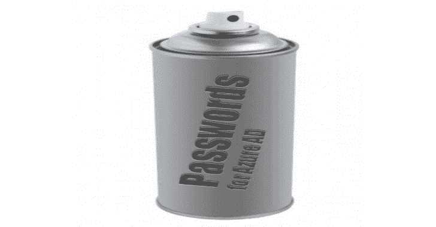

# SSOh-No:用于测试 Azure AD 的用户枚举和密码喷射工具

> 原文：<https://kalilinuxtutorials.com/ssoh-no/>

SSOh-No 旨在对任何使用 Azure AD 或 O365 的组织进行枚举用户、密码喷射和暴力攻击。

通常，此端点会提供极其详细的错误，可利用这些错误通过暴力/喷射攻击来枚举用户并验证其密码，同时也无法记录任何失败的身份验证尝试。

该工具是 arstechnica 研究文章中演示的 PoC 的武器化版本，该文章讨论了利用端点的技术。

微软知道这个端点，但是通常它被标记为一个特性，而不是一个错误。

该端点执行“智能锁定”,可以通过旋转 IP 来绕过它。

### 为什么这是独一无二的？

SSO 自动登录端点不包含任何排序栏的日志记录，可能会更新用户的“上次登录”时间。

以下内容已经过测试，不包含日志:

*   AzureAD
*   哨兵
*   身份保护者(前身为高级线程保护)
*   云应用的捍卫者

## 用法

**$。/SSOh-No -h
用法:SSOh-No[-h |–help][-e |–email " "][-p |–password " "]
[-U |–userlist " "][-o |–outfile " "]
枚举和滥用一个不符合标准的 Azure SSO 端点。
参数:
-h-帮助打印帮助信息
-e-Email 要查询的邮箱地址。例如:user@domain.com
-p-Password 密码喷。例如:Password123！
-U–userlist 指定要枚举的 userlist
-o–outfile 指定 outfile。示例:validated.txt**

## 即将推出的功能

*   绕过智能锁的代理实施
*   来自密码列表的密码暴力(单用户-没有针对用户列表的密码列表暴力的计划)

[**Download**](https://github.com/optionalCTF/SSOh-No)