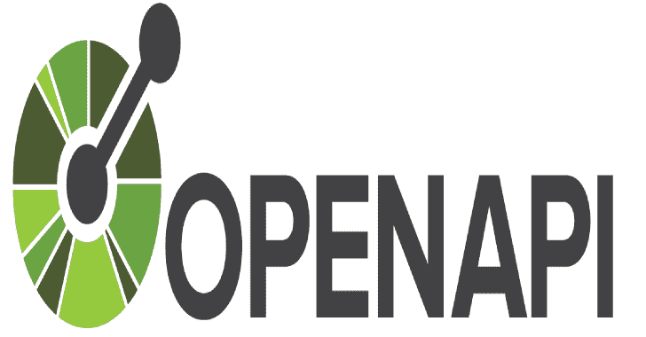

# Swurg:将 OpenAPI 文档解析成 Burp Suite，用于自动化基于 OpenAPI 的 API 安全评估

> 原文：<https://kalilinuxtutorials.com/swurg/>

Swurg 是一个为 OpenAPI 测试设计的 Burp 套件扩展。

OpenAPI 规范(OAS)为 REST APIs 定义了一个标准的、与编程语言无关的接口描述，它允许人类和计算机发现并理解服务的功能，而无需访问源代码、附加文档或检查网络流量。当通过 OpenAPI 正确定义时，消费者可以用最少的实现逻辑理解远程服务并与之交互。与接口描述为低级编程所做的类似，OpenAPI 规范消除了调用服务时的猜测。

机器可读 API 定义文档的用例包括但不限于:交互式文档；文档、客户端和服务器的代码生成；和测试用例的自动化。OpenAPI 文档描述了 API 的服务，并以 YAML 或 JSON 格式表示。这些文档可以静态生成和提供，也可以由应用程序动态生成。

–open API 倡议

由于 Burp Suite(行业标准)缺乏本机 OpenAPI 解析功能，对基于 OpenAPI 的 API 执行安全评估可能是一项单调乏味的任务。这种情况的解决方案是使用第三方工具(例如`**SOAP-UI**`)或实施定制脚本(通常基于每个约定)来处理 OpenAPI 文档的解析，并将结果集成/链接到 Burp Suite 以使用其一流的扫描功能。

Swurg 是一个 OpenAPI 解析器，旨在通过允许安全专业人员使用 Burp Suite 作为基于 OpenAPI 的 API 的安全评估的独立工具来简化整个过程。

* * *

**支持的功能**

*   OpenAPI 文档可以从提供的文件或 URL 中解析。该扩展可以使用`**Target -> Site map**`上下文菜单下的`**Send to Swagger Parser**`特性直接从 URL 获取 OpenAPI 文档。
*   解析 OpenAPI 文档，原名`**Swagger specification**`，完全符合 OpenAPI 2.0/3.0 规范(OAS)。
*   在将请求发送到其他 Burp 工具之前，可以在扩展中直接查看/编辑请求。
*   请求可以发送到`**Comparer, Intruder, Repeater, Scanner, Site map and Scope**`打嗝工具。
*   匹配特定标准的请求(详见“参数”选项卡)可以被拦截，以自动匹配和替换“参数”选项卡中定义的已解析参数默认值。此功能允许在将请求发送到其他 Burp 工具(如扫描仪)之前对其进行微调。已编辑的请求可以在 Burp 消息编辑器的“已修改请求(OpenAPI 解析器)”选项卡中查看。
*   突出显示行，允许 pentesters 突出显示“有趣的”API 调用和/或为它们标上颜色代码，以便进行报告。
*   支持 JSON 和 YAML 格式。

* * *

**安装**

**编译**

**Windows & Unix**

*   在您的系统上安装和配置 https://gradle.org/。
*   下载/克隆此存储库

git 克隆 https://github . com/aress 31/swburg
CD $\ swburg \

创建独立的 jar:

【T0 美元的学位授予人】T1

**将扩展加载到 Burp 套件中**

在 Burp Suite 中，在`**Extender/Options**`选项卡下，点击`**Add**`按钮并加载位于`**.\build\libs**`文件夹中的`**swurg-all**` jar 文件。

或者，您现在可以直接从`BApp Store`安装/加载这个扩展。

*注意:`**BApp Store**`上发布的版本可能落后于该存储库上可用的版本。*

* * *

**可能的改进**

*   美化图形用户界面。
*   对 OpenAPI 模式进行深度解析，以收集所有嵌套参数及其示例/类型。
*   代码简化/重构。
*   启用单元格编辑来直接从 GUI 更改 API 调用。
*   进一步优化源代码。
*   实现对认证测试的支持(通过用户提供的 API 密钥)。
*   通过添加参数类型(例如，inquery、inbody 等)来改进 Param 列。).
*   实现表格和上下文菜单。
*   增加扩展详细度(通过底部面板)。

[**Download**](https://github.com/aress31/swurg)