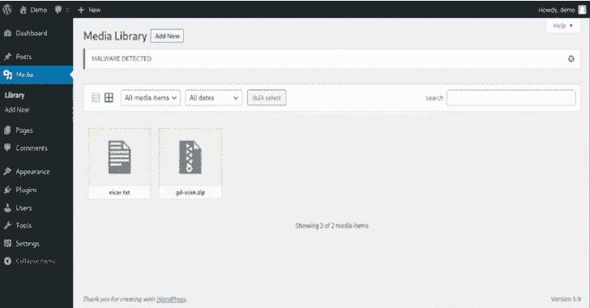

# 裁决即服务:分析文件中的恶意内容

> 原文：<https://kalilinuxtutorials.com/verdict-as-a-service/>

.png)

***判决**——即服务* (VaaS)是一种服务，它提供了一个平台来扫描文件中的恶意软件和其他威胁。它允许在您的应用程序中轻松集成。只需几行代码，您就可以开始扫描文件中的恶意软件。

**注意:所有的 SDK 目前都是原型，正在大量建设中！**

## 集成恶意软件检测

轻松将恶意软件检测集成到任何种类的应用程序、服务或平台中。

用几行代码创建一个命令行扫描程序来查找恶意软件:例如

## SDK

目前 Rust，Java，Typescript，微软的 SDK。NET，Python，PHP 都可以。

| 功能 | 锈 | Java 语言(一种计算机语言，尤用于创建网站) | 服务器端编程语言（Professional Hypertext Preprocessor 的缩写） | 以打字打的文件 | 。网 | 计算机编程语言 |
| --- | --- | --- | --- | --- | --- | --- |
| 检查 SHA256 | 981 号房 | 981 号房 | 981 号房 | 981 号房 | 981 号房 | 981 号房 |
| 检查 SHA256 列表 | 981 号房 | 981 号房 | -好的 | 981 号房 | 981 号房 | -好的 |
| 检查文件 | 981 号房 | 981 号房 | 981 号房 | 981 号房 | 981 号房 | 981 号房 |
| 检查文件列表 | 981 号房 | 981 号房 | -好的 | 981 号房 | 981 号房 | -好的 |
| 用户侧可追踪性的自定义 Guids | -好的 | -好的 | 981 号房 | -好的 | -好的 | -好的 |

# 裁决即服务 Rust SDK

使用 Rust 中的 VaaS API 扫描文件中的恶意软件和其他威胁。

## 集成测试:真实 API

目前,/tests 文件夹下的所有测试都是针对真实 API 的集成测试。因为他们需要凭证，(用户，令牌)这些需要作为环境变量提供。

要么导出一个`**VAAS_USER**`和`**VAAS_TOKEN**`环境变量，要么使用`**.env**`文件。要使用一个`**.env**`文件，只需在根目录(如`**Cargo.toml**`所在的位置)创建它，并添加变量及其值，如 **`KEY=VALUE`。**

`**.env**`文件不会被签入到 *git* 中，它可以用来存储本地机器上的敏感环境变量。

# 裁决即服务 Java SDK

使用 Java 中的 VaaS API 扫描文件中的恶意软件和其他威胁。

## 用法

得到一个 SHA256 文件的判决。

**public class main class {
public static void main(String[]args){
//连接到 VaaS 端点
var config = new WsConfig(
clientId，
clientSecret，
new URI(tokenUrl)，
new URI(VaaS URL))；
var Vaas = new Vaas(config)；
vaas . connect()；
//对 a sha 256
var sha 256 = new sha 256(" 000005 c 43196142 f 01d 615 a 67 b 7 da 8 a 53 CB 0172 F8 e 9317 a2 EC 9 a 039 a 1 da 6 Fe 8 ")；
var cts = new CancellationTokenSource(duration . of seconds(10))；
var verdict = vaas . forsha 256(sha 256，cts)；
//从 VaaS 端点
断开 VaaS . Disconnect()；
//打印裁决结果(干净、未知、恶意、PUP)
System.out.println("裁决:"+裁决. getVerdict()。name())；
}
}**

得到一份文件的裁决。

**公共类 MainClass {
公共静态 void main(String[] args) {
//连接到 VaaS 端点
var config = new ws config(token)；
var Vaas = new Vaas(config)；
vaas . connect()；
//获取 sha 256
var file = path . of(" my file ")；
var cts = new CancellationTokenSource(duration . of seconds(10))；
var verdict = vaas . for file(file，cts)；
//从 VaaS 端点
断开 VaaS . Disconnect()；
//打印裁决结果(干净、未知、恶意、PUP)
System.out.println("裁决:"+裁决. getVerdict()。name())；
}
}**

## 集成测试:真实 API

目前,/src/test 文件夹下的所有测试都是针对真实 API 的集成测试。因为他们需要凭证(token)。这些值需要作为环境变量提供。

导出 VAAS 令牌环境变量或使用。环境文件。使用。env 文件，只需在根目录(例如 Readme.md 所在的位置)创建它，并添加变量及其值，例如 KEY=VALUE。

的。env 文件不会被签入 git，它可以用来存储本地机器上的敏感环境变量。

# 裁决即服务 PHP SDK

用于裁决即服务 API 的 PHP SDK。使用 PHP 中的 VaaS API 扫描文件中的恶意软件和其他威胁。

关于用法的例子，请看测试文件夹或者例子文件夹中的例子。

# gdata-vaas

一个可以轻松利用 G DATA VaaS 的 SDK。

*裁决即服务* (VaaS)是一种服务，它提供了一个平台来扫描文件中的恶意软件和其他威胁。它允许在您的应用程序中轻松集成。只需几行代码，您就可以开始扫描文件中的恶意软件。

## SDK 是做什么的？

作为一个开发者，它给了你一个与 G DATA VaaS 对话的功能。它将 API 的复杂性包装成 4 个基本函数。

### 前置作业 256

如果您为一个文件计算 sha256，您可以针对 G 数据 VaaS 请求 sha256。这是从我们的服务中获得裁决的最快方式。

### forsha 256 列表

您还可以通过一个函数调用请求多个 sha256。

### forFile

也可以要求一个文件本身。您仍然可以通过 Sha256 获得快速裁决的好处，因为 SDK 会首先为您完成这项工作。但是另外，如果我们不知道这个文件，这个文件会被我们上传并(自动)分析。

### forFileList

您也可以通过一个函数调用来请求多个文件。

## 如何使用

### 安装

**npm 安装 gdata-vaas**

## 导入

**从“gdata-vaas”导入 Vaas；**

## 使用 Visual Studio 代码开发

必需的扩展:

*   es benp . beauty-vs code

使用以下内容扩展 settings.json:

**{
" editor . formatonsave ":true，
"[JavaScript]":{
" editor . default formatter ":" es benp . prettle-vs code "
}，
"[typescript]":{
" editor . default formatter ":" es benp . prettle-vs code "
}
}**

[**Download**](https://github.com/GDATASoftwareAG/vaas#im-interested-in-vaas)